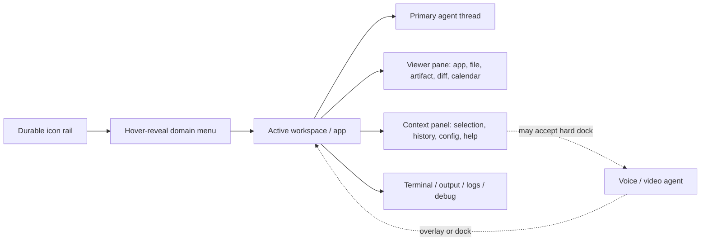
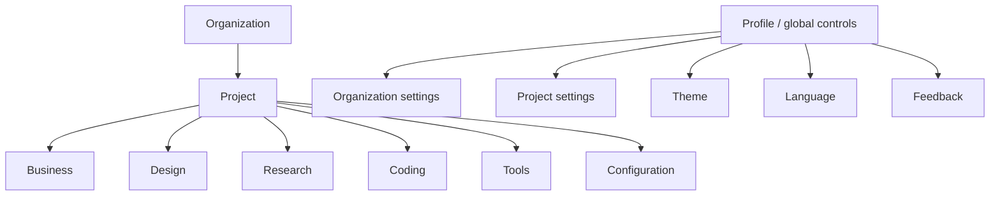
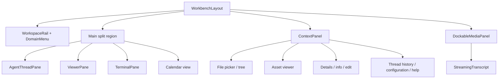
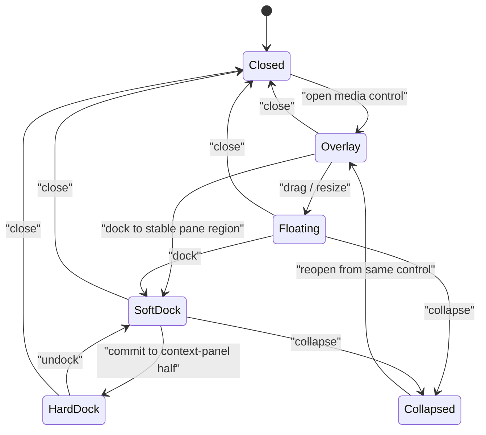
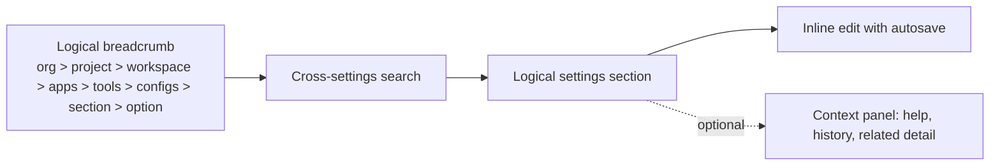

# Workspace Shell Design Requirements

**Status:** Design-source extraction and synthesis  
**Date:** 2026-07-17  
**Source material:** `1.png` through `5.png` in this directory; companion discussion: [Unified Workspace Shell + Domain Sidebar](../roadmaps/workspace/2026-07-17-unified-shell-and-sidebar-discussion.md).

## Purpose

This document turns the five visual notes into a coherent design brief for the
Jami Studio workbench. It preserves the source intent, separates settled
direction from options still being explored, and names the reusable layout
primitives required to build the shell consistently.

The intended result is one quiet, desktop-class agent workspace: a primary
conversation and work surface with durable, configurable navigation; flexible
panes; a contextual information rail; and an optional voice/video companion.
The shell should feel direct and highly capable without advertising its own
complexity.

## Executive design direction

- **One workbench, not a collection of dashboards.** The main agent thread is
  the primary interaction surface. File, artifact, app, terminal, calendar,
  and configuration views are panes within that surface.
- **Minimal surface clutter.** Avoid development-status copy, generic hints,
  redundant titles, and explanatory filler. Assume user competence; reveal
  detail at the moment it is needed.
- **Durable but unobtrusive navigation.** A thin icon rail is always present.
  Workspace/domain navigation expands on hover and organizes pages by logical
  domain rather than by a flat app list.
- **One responsive pane system.** The agent thread, context panel, viewer,
  terminal, calendar, and voice/video layer participate in the same split,
  collapse, dock, and overlay rules.
- **Motion is functional.** Resizing, reveal, collapse, and docking should be
  soft, cohesive, and continuous—“smooth like jelly”—but never attention
  seeking or obstructive.

## Visual language

| Area | Requirement |
| --- | --- |
| Tone | Dark, restrained, technical, and calm; the UI is a focused machine interface, not a SaaS dashboard. |
| Density | Spacious structure with clear alignment, strong negative space, and only the labels necessary for orientation. |
| Hierarchy | Prefer direct labels, group boundaries, and calm dividers over decorative cards, floating helper text, or repeated headings. |
| Navigation | Icon rail plus hover-reveal domain menu; use concise text only when the menu is expanded. |
| Animation | Cohesive, soft easing for panels, scroll fades, overlays, and width changes. Honor reduced motion. |
| Scrolling | Streaming/transcript surfaces fade subtly at the top and bottom and scroll smoothly; no visual jitter. |
| Help | Contextual, off by default, available through a small help/settings control; never force navigation or block work. |

## Shell anatomy



### Canonical desktop layout

```text
┌──────┬─────────────────┬───────────────────────────────────┬───────────────┐
│ icon │ workspace /     │ primary work surface              │ context panel │
│ rail │ domain menu     │                                   │               │
│      │ (hover expand)  │  agent thread + viewer panes      │ history       │
│      │                 │                                   │ files         │
│      │                 │                                   │ settings      │
│      │                 │ ─ terminal / output / logs ────── │ help          │
└──────┴─────────────────┴───────────────────────────────────┴───────────────┘
```

The **icon rail** is durable. The adjacent **domain menu** is a hover-reveal
surface, not a permanently expanded sidebar. The **primary work surface** owns
the main thread and the active pane arrangement. The **context panel** is
optional, resizable, and holds information that should not compete with the
main task.

## Navigation model

### Domain hierarchy

The source mock groups navigation at two levels:



The companion shell discussion refines the future grouping as **business,
design, research, coding, and full suite**. Treat the source labels as the
initial information architecture and keep grouping, order, visibility, and
names user-adjustable.

### Navigation behavior

- The rail never fully expands; it is icon-only in its resting state.
- Hovering the rail opens the domain menu. A possible site mark can serve as
  the expansion target.
- No extra icons appear merely because a panel is collapsed; avoid creating a
  second competing navigation strip.
- Domain items can contain nested accordions. Nested subpages, tools, related
  apps, and app-specific configuration live here rather than in one-off footer
  controls.
- Domain-level groups can include examples such as Business (Calendar,
  Messages, Knowledge, Analytics), Design (Brand, Generative, Design, Assets),
  Research (Sherlock, Entity Graph, Sources, Workstation), Coding (Orchestra,
  Agent management, nested tools), and Tools (Extensions, Add-ons, Plug-ins,
  Needs Canon, Streamline). These are source examples, not a frozen product
  taxonomy.
- A project chooser appears at the top of the expanded menu and opens on
  hover. The source example shows organization selection (`Jami`, `Yrka`) and
  project selection (`navin gardens`, `q1 2026`, `q2 2026`, `Marketing`,
  `GTM`).
- Profile/global controls open a full-page settings surface when appropriate;
  they must not conflict with domain/app navigation.

## Pane system

### Reusable primitives

| Primitive | Responsibility | States |
| --- | --- | --- |
| `WorkspaceRail` | Always-present, icon-only global anchor and expansion affordance. | resting, hover-reveal, active-domain |
| `DomainMenu` | Project chooser, logical domain groups, nested app/tool pages. | closed, hover-open, nested accordion, project switching |
| `WorkbenchLayout` | Coordinates resizable regions and preserves pane intent across navigation. | single, vertical split, horizontal split, quad-like grid, full-screen pane |
| `AgentThreadPane` | Primary persistent chat/work thread. | open, focused, collapsed title, context-aware |
| `ContextPanel` | Secondary information: selected item details, history, file tree, configuration, help. | open, resized, hard-dock host, collapsed |
| `ViewerPane` | Hosts app UI, file trees, assets, artifacts, diffs, or calendars. | open, split, full-screen, swapped content |
| `TerminalPane` | Terminal, output, logs, debug; usable in any app. | open, smart-flipped, collapsed, split below/alongside viewer |
| `DockableMediaPanel` | Voice/video/avatar companion that can overlay or occupy a stable dock. | overlay, floating, soft dock, hard dock, collapsed, closed |
| `StreamingTranscript` | Read-only or interactive transcript attached to media/agent activity. | hidden, visible, streaming, scrolled |
| `SettingsCanvas` | Full-page, logically grouped configuration surface. | overview, search result, inline edit, contextual-help-visible |

### Pane ownership and composition



### Layout rules

1. Panes resize directly and retain a coherent minimum width/height. The
   transition should interpolate rather than snap where feasible.
2. The context panel and agent thread can share the available width with a
   docked media panel. A media panel must never obscure an active chat or
   viewer without an explicit overlay choice.
3. Terminal/output/logs/debug is a first-class pane, not a modal. It can be
   placed under a primary surface, at the side, or in a chosen split layout.
4. Viewer content is interchangeable: file picker/tree, asset viewer,
   upload/export, details/info/edit, app/workspace quick configuration, model
   configuration, app/project/workspace settings, agent bird’s-eye view, and
   thread history are all candidates.
5. A collapsed agent thread may show only a compact title—e.g. “Studio #2 —
   App | Thread title collapsed”—while preserving the thread’s placement and
   reopening affordance.
6. The workbench supports a one-page fit. New work opens inside the current
   workbench rather than proliferating detached windows.

## Voice and video companion

The source explores the same feature in several positions. The stable intent is
not “always docked”; it is a companion that can participate in the pane system
without interrupting work.



### Media requirements

- Works for any app and preserves the active call/session across app switches.
- Starts as a simple overlay or soft dock; it can be dragged and resized.
- When floating, cap the panel at roughly one quarter of the screen and keep it
  clear of durable navigation.
- A hard dock may take half of the context panel; in that state the agent
  panel uses the remaining half. A soft dock supplies a stable home while
  remaining flexible in width and placement.
- Docking can be vertical (side-by-side) or top/bottom depending on the active
  pane layout; both must coexist cleanly with the chat stream.
- The media card has a start/end control with a mute companion. Include one
  compact manual-input entry point for voice-agent interaction.
- A read-only streaming transcript is optional. It fades near the scroll
  boundaries, scrolls smoothly, and can be toggled with user chat.
- Voice interaction is independent from the main text agent where appropriate:
  simple on-device STT, TTS using the selected voice, and a voice selection per
  workspace are all explicitly called out in the source.

## Settings experience

Settings should be a full-page workspace surface, not a miscellaneous list of
buttons at the bottom of a sidebar.



### Settings requirements

- Use concise breadcrumbs to orient the user. Do not repeat a large page title
  that says the same thing as the breadcrumb.
- Provide search across all settings, mapped to the same logical hierarchy.
- Keep controls vertically aligned across sections, with uniform groups,
  intelligent use of space, simple dividers, and intentional negative space.
- Prefer inline edit and automatic save. Do not expose developer status,
  implementation pointers, or generic setup instructions in normal view.
- Group related provider/model controls as a form grid when applicable. The
  source mock includes Workspace LLM Provider, Voice LLM Provider, STT Provider,
  Voice Provider, Model, Voice LLM Model, STT Model, Voice ID, Image Provider,
  Video Gen Provider, Audio Gen Provider, Embeddings Provider, and their model
  selections.
- Select controls should open in a clean logical group with nested accordions,
  minimal chrome, a proper opaque background, subtle panel depth, no extra
  labels, and no development copy.
- Help lives in the context panel and is enabled from a small control or
  hotkey/settings toggle. It may offer deep links to full documentation in a
  new tab, but it must not force a navigation or warn the user away from work.

## Calendar / structured-work example

The calendar mock validates that specialized app content belongs in the same
shell rather than receiving special navigation.

- A two-week scheduling view can occupy the viewer region.
- It shows an hourly grid for the selected days/week.
- The workspace agent thread remains visible when open and accepts direct chat
  alongside calendar work.
- The voice/avatar agent may appear as a small overlay or as a docked pane;
  the calendar uses the remaining available width.
- The context panel remains fully usable for related information and history.

## Interaction quality bar

| Scenario | Expected behavior |
| --- | --- |
| Hovering the rail | Reveal the domain menu smoothly; leave the durable rail in place. |
| Changing project | Update the domain menu and active workspace context without breaking the current workbench frame. |
| Opening a nested item | Use a simple accordion/popout, preserve the parent’s grouping, and avoid a new permanent sidebar. |
| Splitting a pane | Resize surrounding panes continuously; keep chat, context, and terminal usable. |
| Opening voice/video | Use its prior placement when possible; respect open panes rather than covering them. |
| Collapsing a pane | Preserve its identity and provide an obvious reopen control in the same area. |
| Long transcript/log | Allow smooth, elastic-feeling scrolling with top/bottom fade treatment; do not introduce visual noise. |
| Asking for help | Open targeted contextual help, not a blocking tour or forced navigation. |

## Decisions captured vs. decisions still open

### Captured direction

- A unified workbench shell, domain grouping, durable thin rail, and one
  primary chat/work thread are the design direction.
- The shell hosts adaptable split panes and promotes work within the current
  workspace over page hopping.
- The context panel is the home for secondary information, history,
  configuration, and contextual help.
- Voice/video must persist across app transitions and work cleanly with both
  overlay and dock layouts.

### Open design choices

- Which media docking modes ship first: overlay only, overlay plus soft dock,
  or hard docking into the context panel?
- Exact domain taxonomy and which user adjustments are supported initially
  (reorder, regroup, rename, hide, per-user override).
- How much terminal/log exposure is default versus opened on demand.
- Whether a collapsed thread shows only a title, an icon, or a small activity
  summary.
- Exact desktop/minimum-width breakpoints and the mobile adaptation. The mocks
  are desktop-first and do not specify a mobile layout.

## Source transcription index

The entries below preserve the unique text and intent from the mocks. Repeated
placeholder/transcript text is listed once instead of reproduced every time it
appears. Obvious source typos are retained in quotation marks where useful;
editorial headings are normalized.

### `1.png` — unified shell, sidebar, and context-panel notes

**Top-level direction**

- “Suer clean UI with MINIMAL abstractions, structures, disturbances.”
- “like opencodes new desktop app look and feel with the panel added”
- “dark, inlay screen feel, renders anything :)”
- “normal chat transcript flow”
- “resizeable, smooth like jelly - TOP NOTCH OPEN SOURCE cohesive motion never hijack or overwhelm, always glide and soften”
- “super minimal surface clutter. NO dev text NO hints NO random explainer copy - ASSUME user competence”

**Context panel**

- “File Picker/trees”
- “asset viewer”
- “upload/export”
- “details/info view/edit”
- “app/workspace quick configs”
- “model configs”
- “project/workspace settings/configs”
- “agent birdseye”
- “thread history”
- “grouped in logical groupings behind single icons with popout menus”
- “filter flow vs context flow”
- “top vs side”
- “no icons when panel is in collapsed state except potential site logo serving as an expand”
- “full collapsed/right sidebar will be click to expand”

**Domain/sidebar model**

- “DOMAIN LEVEL”: Business, Design, Research, Code, Tools, Configs, Profile.
- “Never Expands” / “Icon Only” / “Clean crisp tooltip” / “Open inside” /
  “to the right aligned vertically” / “on hover only.”
- “App Level”: subpages, tools, associated apps, app configs; “all redundancy
  moved upstream to domain wherever feasible.”
- “collapsed hidden”; “small icon to open on the durable sidestrip.”
- “neat, organized, clean no unnecessary abstractions”; “nested accordians,
  hidden by default.”
- “all bottom junk moved to domain behind proper menu (feedback, profile, app
  nav will be replaced with new setups, etc).”

**Project and profile menus**

- “Project Menu / Opens on hover of the sidebar / shows the normal workspace
  items / tools / configs / etc / per-workspace per app / nested in logical
  accordians / settings deduped moved to global / doesnt cover chat / super
  jelly smooth.”
- “Org selector” and “project select”; source choices: Jami, Yrka, navin
  gardens, q1 2026, q2 2026, Marketing, GTM.
- “Profile Menu / connected others / configs etc / OPENS to full-page /
  -settings where appropriate / call cover chat; doesnt conflict with the
  sidebar menu. / plays nicely evenly split. / one page fit always.”

### `2.png` — Studio terminal/log and media layouts

- “Studio #1 / Smart-flip terminal/logs / Works for any app / History/configs
  live in context panel.”
- “Terminal/output/logs/debug.”
- “Studio #2 - App | Thread title collapsed.”
- “Voice/Video does nto ‘dock’ per say, but can dock.. lol / width wise to
  expand, contract with the chat panel or the context panel.”
- “Agent Work happening as normal.”
- “Overlay with chant [chat] agent panel closed. if opened, would open in normal
  place. delegate voice/video to half vertical - pinned to top, feed open/closed
  based on preagent panel open - preserve. clean expected.”
- “Beautiful Text Streaming with fade on top/bottom scrolls elastic-scroll,
  infinite smooth.” (repeated throughout the mock)

### `3.png` — hard/soft dock exploration

- “Potential Hard Docks / Repeat on Context Panel.”
- “Agnet [Agent] Panel resumes other half -when DOCKED.”
- “can float on top of the cgant [agent] panel freely resized normal floating
  style.”
- “soft dock gives stable home, split vertical with agent panel.”
- “flex width on resize, collapse with agent panel.”
- “triggered back open from same way to close, agent panel icon.”
- “Potential Soft Docks.”
- “Potential floating soft docks and layout options.”
- “Floating Overlay / Voice or Video / Stat/End Toggle with Mute companion /
  Streaming response / Small inline one line entry for manual input / Can ‘soft
  dock’ to the 4 corners / to the chat panel, top/bottom/full coverage context
  panel, bottom, top, full coverage bottom and top is always half, no drag
  vertical resize when docked / smart drag flex left right up down when floating,
  capped at 1/4 screen - minus … / left workspace sidebar thin outermost always
  collapsed bar.”
- “Docked to flex width top or bottom w/ or w/o chat stream.”

### `4.png` — workspace settings form and settings-context direction

- “Project-App-level / Full Nav Menu.”
- “Workspace menu.”
- Breadcrumb example: “jami-studio | new-project | Business | CalAccounts.”
- “Logical Settings Groupings neatly uniformed with vertically aligned contents
  across sections.”
- “Minimal structure, enough to contain and define.”
- “this space will be filled with settings, not pointless titles and redundant
  titles telling me what settings im about to change - i get it, let the
  settings speak for itself. … direct flow, follow the proper channels.”
- “search at the top across all settings mapped to the logical breadcrumb nav,
  section, config flows org>project>workspace>apps>tools??>configs??>section>option.”
- “Clean logical grouped nested accordians minimal no need for chevrons. Opens
  neatly uniform, above proper zindex proper opacity bg for no--bleedthrough
  proper panel depth -subtle! NO DEV COPY NO EXTRA LABELS ONLY WHAT IS 100%
  necessary.”
- “NEAT UNIFORM SETTINGS LAYOUT / ALWAYS VERTICALLY EVEN / ALIGNED - CLEAN /
  INTELLIGENT GROUPING AND USE OF SPACE / NEGATIVE SPACE, SIMPLE DIVIDERS.”
- “Easy intuitive inline edit / auto save / hassle-free / developer delight /
  DO NOT GIVE ME HINTS AND SETTING POINTERS AND DEVELOPMENT STATUS.”
- “This is a Rich Settings Context Panel For Additional Info Details e.g.
  History, Cross-workspace connections, preview changes if applicable, HELP -
  contextual / place for Help hints / MUST be uniformly displayed, will be able
  to toggle a help feature however any elements get help in the context panel /
  easy toggle off/on hotkey/settings toggle -from small ? icon. inline help
  from docs, links to full docs--new tab never force nav, warn/ask.”

### `5.png` — calendar plus agent/voice placement

- “Overlay voice/avatar agent -simple.”
- “Docked voice/avatar agent -simple.”
- “Two week Calendar View for Scheduling.”
- “Workspace Agent Thread / Always visible when open / Can always chat direct /
  STT-TTS with apart [apart] from main engine / Simple on-device STT / TTS
  utilize voice / read only / voice per workspace.”
- “Context Panel / Full use / Always.”
- “Hourly View For the chosen days sweek [week].”
- “Agent Work happening as normal.”
- “Optional Chat Transcript from voice/avatar agents / streaming / can toggle
  on/off user chat.”

## Source images

- [1.png](1.png)
- [2.png](2.png)
- [3.png](3.png)
- [4.png](4.png)
- [5.png](5.png)
