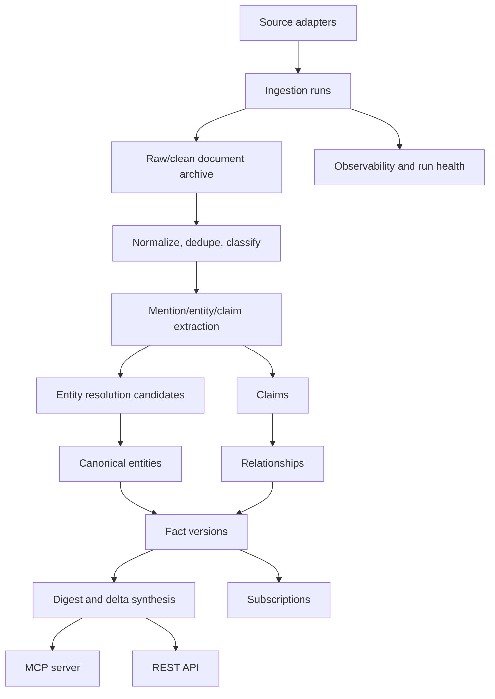

# Intercal Foundation Report

Date: 2026-05-21
Status: Draft accepted for implementation planning, updated 2026-05-21
Scope: Product foundation, architecture, implementation standards, verification model, and open decisions

## Executive Summary

Intercal should be built as an open temporal knowledge substrate for agents and LLM applications. Its core job is not to scrape news, produce daily digests, or behave like a generic RAG database. Its job is to answer a more precise question:

> Given a topic, entity, claim, or model cutoff date, what has changed since then, what evidence supports it, how confident is the system, and how compactly can that update be delivered?

The strongest product shape is a provenance-backed temporal graph built from source documents, extracted claims, resolved entities, typed relationships, and append-only fact history. Agents should be able to query Intercal through MCP and APIs for compact deltas, entity state, claim verification, source evidence, freshness, and later subscriptions.

The early Changelog prototype and Sherlock research app are useful references only. Changelog proves the value of source adapters, token tiers, and public API delivery. Sherlock proves the value of entity clustering, investigation workflow, graph UX, and evidence discipline. Intercal should not copy or retrofit either codebase. It should use a clean greenfield model optimized for public, auditable, temporal knowledge.

This report assumes the end goal is the final production shape, not a narrow prototype that leaves major architectural work for an undefined future. The implementation plan may be split into sequential volumes for context management, but the planned destination should include ingestion, extraction, entity resolution, embeddings, temporal graph state, MCP/API access, synthesis, subscriptions, feedback/review loops, operations, security, deployment, auditability, and production verification.

## Product Thesis

LLMs and agents have three recurring post-training problems:

1. Their world knowledge is stale after the training cutoff.
2. Retrieval gives them documents, but not necessarily resolved facts, temporal state, or contradiction-aware deltas.
3. Agent memory systems are local and inconsistent; they lack a shared, cited, open substrate for recent knowledge.

Intercal fills that gap by maintaining a continuously updated, source-grounded knowledge layer that can be queried by date, topic, entity, relationship, claim, confidence, and token budget.

The project should be optimized for:

- Auditable evidence over opaque summaries.
- Append-only history over mutable current-state blobs.
- Conservative entity resolution over aggressive merge automation.
- Agent-native access over human-dashboard-first UX.
- Simple open-source deployment over premature infrastructure complexity.
- Strong repo rules and verification from the first commit.
- Provider-agnostic infrastructure so core data, contracts, and workflows can move as vendors and model APIs evolve.

## Non-Goals

Intercal should not become:

- A general web search engine.
- A daily news blog.
- A model training pipeline.
- A generic vector database wrapper.
- A private research notebook.
- A clone of the Changelog prototype.
- A clone of Sherlock's local workspace graph.
- A system that silently rewrites facts without provenance.
- A vendor-locked product where a database host, model provider, queue, or deployment platform becomes part of the domain model.

## System Primitives

These primitives should form the conceptual and database backbone.

### Source

A source is a configured origin of data: RSS feed, API, dump, repository, registry, government feed, research index, or user-submitted URL.

Source records should include reliability metadata, rate limits, license/terms metadata, adapter config, run cadence, historical health, and whether source material may be stored, summarized, redistributed, or only cited.

### Source Document

A source document is immutable evidence. It may be an article, API record, dataset row, release note, paper abstract, government notice, changelog entry, or other ingested unit.

Documents should be content-hashed, normalized, timestamped, language-tagged, and stored with both `published_at` and `ingested_at`. Raw content belongs in object storage when needed; cleaned text and retrievable metadata belong in Postgres.

### Mention

A mention is a text span in a document that appears to refer to an entity, role, office, product, place, concept, event, law, or source.

Mentions are not entities. They are evidence candidates. This distinction prevents weak extraction from polluting canonical records.

### Entity

An entity is a canonical thing: person, organization, place, role, office, product, event, concept, legislation, technical artifact, source, dataset, or jurisdiction.

Entity records should carry canonical display name, type, aliases, external IDs, current denormalized state, importance, first seen, last updated, and deprecation/merge metadata.

### Role / Office

Roles and offices must be modeled separately from people and organizations.

"US Secretary of State", "CEO of OpenAI", and "Chair of the Federal Reserve" are not aliases for the current occupant. They are entities or structured role nodes with temporal occupancy relationships. This is mandatory for historical correctness.

### Entity Resolution Candidate

Entity resolution should be auditable and reversible. Intercal needs a first-class candidate/decision table rather than a hidden alias map.

Each candidate should include:

- left entity
- right entity
- proposed decision: merge, keep separate, needs review
- confidence
- matching signals
- negative signals
- evidence documents
- decision source: rule, model, human, external ID
- status
- reversible merge metadata

False non-merges are acceptable early. False merges are data corruption.

### Claim

Claim should be first-class. This is the most important addition to the early brainstorm.

A claim is an atomic factual assertion extracted from one or more source documents. Example:

```text
Sam Altman holds the role of CEO at OpenAI as of 2026-05-21.
```

Claims should include subject, predicate, object, qualifiers, valid time, source documents, extraction confidence, contradiction state, normalized text, raw quote/spans where allowed, and lifecycle status.

Relationships and entity versions should be derived from claims, not extracted as free-floating facts.

### Relationship

A relationship is a typed temporal edge between entities, derived from claims and evidence. Examples:

- person holds role
- organization owns product
- company acquired company
- paper cites paper
- law amends law
- event occurred in place
- source reported claim
- claim contradicts claim

Relationships need `valid_from`, `valid_until`, `recorded_at`, confidence, source document IDs, and properties.

### Fact Version

A fact version is an append-only record of what Intercal believed at a point in time.

Intercal should support bitemporal reasoning:

- `valid_from` / `valid_until`: when the fact is or was true in the world
- `recorded_at`: when Intercal learned or recorded it

This is required for reliable cutoff-gap queries.

### Topic

A topic is a normalized query surface that maps to entities, claims, documents, relationships, and summaries. Topics may be user-defined, system-derived, or materialized because of repeated demand.

Topics are useful for cached summaries but should not be the source of truth.

### Digest

A digest is an agent-facing synthesis generated from evidence and graph state. It is cached by topic/entity/query, date range, and token budget.

Digests are delivery artifacts, not canonical facts.

### Subscription

A subscription records interest in an entity, topic, relationship type, claim pattern, or source. It should support polling and webhooks later.

This is a meaningful differentiator: agents can be notified when knowledge changes instead of repeatedly asking broad refresh questions.

## Canonical Architecture

Intercal should use two primary runtimes:

- Python for ingestion, extraction, NLP, entity resolution, embeddings, synthesis jobs, and scheduled workers.
- TypeScript for the public API, MCP server, SDK, dashboard, and request validation.

Postgres should be the shared source of truth. Redis and object storage should support queue/cache/archive concerns, not own canonical data.



## Repository Shape

The implementation should be a monorepo with clear package ownership.

```text
intercal/
  AGENTS.md
  README.md
  package.json
  pnpm-workspace.yaml
  pyproject.toml
  docs/
    analytics/
    api/
    data/
    db/
    services/
    configuration/
    engineering/
    monitoring/
    communications/
    troubleshooting/
    bylaws/
    membership/
    admin/
    architecture/
    artifacts/
    decisions/
    operations/
    research/
    roadmaps/
    mcp/
  packages/
    api/             # TypeScript REST API
    mcp-server/      # TypeScript MCP server
    sdk/             # TypeScript client SDK
    shared/          # Shared schemas/contracts generated from source of truth
    dashboard/       # Admin/operator UI
  services/
    ingest/          # Python adapters and ingestion jobs
    extract/         # Python extraction and claim modeling
    resolve/         # Python entity resolution pipeline
    synthesize/      # Python digest/delta generation
  db/
    migrations/
    schema/
    seeds/
  scripts/
    verify/
    dev/
```

The exact directory layout can change after tooling selection, but ownership boundaries should not blur:

- API and MCP read from validated query services.
- Python workers write canonical pipeline outputs through repository/service boundaries.
- Database migrations own schema, indexes, constraints, and seed vocabularies.
- Shared contracts are generated or centrally defined; no drift between Python and TypeScript payloads.

Current planning artifacts should live under `docs/research/` until converted into canonical architecture docs, plans, or decision records. Reference material is allowed to inform design, but dead ideas should be retired rather than kept alive as parallel truth.

## Data Model Foundation

The first implementation plan should include these tables or equivalent:

- `sources`
- `source_documents`
- `document_chunks`
- `document_embeddings`
- `entity_embeddings`
- `claim_embeddings`
- `ingestion_runs`
- `mentions`
- `entities`
- `entity_external_ids`
- `entity_aliases`
- `entity_resolution_candidates`
- `entity_merge_events`
- `claims`
- `claim_evidence`
- `claim_contradictions`
- `relationship_types`
- `relationships`
- `fact_versions`
- `topics`
- `topic_memberships`
- `digests`
- `subscriptions`
- `api_keys`
- `usage_events`
- `audit_events`

The schema should enforce invariants where practical:

- Unique document content hashes.
- No overlapping active relationship intervals for the same typed edge where the relationship semantics require exclusivity.
- Append-only fact version history.
- Reversible entity merges.
- Source-document evidence attached to every claim used for public answers.
- Strict enum/reference tables for relationship types and entity types where taxonomy stability matters.
- Embeddings attached to explicit owner records and model metadata, never treated as anonymous vector blobs.

## Query Surface

The first MCP/API surface should be small and excellent.

### V1 Tools

1. `get_delta(topic, since_date, token_budget, until_date?)`
2. `get_entity(name_or_id, at_date?, token_budget?)`
3. `search_evidence(query, date_range?, sources?, limit?)`
4. `verify_claim(claim_text, as_of_date?, token_budget?)`
5. `get_sources(entity_or_claim_id, limit?)`
6. `get_freshness(topic_or_entity)`

These tools cover the core agent use case without overextending the protocol too early.

### Later Tools

- `get_relationships(entity, depth, at_date?)`
- `get_timeline(entity_or_topic, from_date, to_date)`
- `get_briefing(topic, token_budget, purpose?)`
- `subscribe(target, webhook_url?, token_budget?, min_importance?)`
- `submit_source(url, context?)`
- `submit_correction(target, correction, evidence_url)`
- `propose_merge(entity_a, entity_b, rationale)`
- `export_subgraph(entity, depth, at_date?)`

## Ingestion Strategy

Start with source classes that prove different types of truth:

1. Structured canonical data: Wikidata changes or dumps.
2. Encyclopedic/current-event data: Wikipedia current events or recent changes.
3. Technical currency: GitHub releases, npm/PyPI, arXiv, or standards docs.
4. High-signal news feeds only after licensing and redistribution constraints are clear.

The system should ingest source documents first, then progressively derive mentions, claims, entities, relationships, and digests.

Every job should be idempotent. Retrying a failed job must not duplicate documents, claims, relationships, or fact versions.

## Scheduling and Jobs

The project should begin with a simple scheduler and explicit job boundaries. It can later add distributed workers without rewriting the pipeline.

Recommended progression:

1. Local/dev: Python CLI jobs plus cron-like scheduler.
2. Early hosted: scheduled workers with queue-backed processing.
3. Scale: distributed workers and workflow orchestration if branching/retry complexity justifies it.

Core jobs:

- `ingest_source`
- `normalize_document`
- `extract_mentions`
- `extract_claims`
- `resolve_entities`
- `derive_relationships`
- `write_fact_versions`
- `build_digest`
- `recompute_freshness`
- `score_source_health`
- `notify_subscribers`
- `cleanup_expired_cache`

## Development Governance

Intercal needs strict foundation rules from the first commit.

The repo should have a short, precise `AGENTS.md` that defines:

- Source-of-truth docs and architecture maps.
- Package ownership boundaries.
- Schema and migration ownership.
- Validation commands.
- Documentation update requirements.
- No-shim/no-dead-idea cleanup policy.
- Generated-file policy.
- Prohibition on copying legacy code from reference projects without explicit approval.
- Commit and closeout expectations.

The project should also include durable decision records in `docs/decisions/`. Every meaningful foundational choice should be recorded once, then implemented consistently.

## Quality Gates

The initial repo should include automated gates before feature work expands.

### TypeScript Gates

- `pnpm format:check`
- `pnpm lint`
- `pnpm typecheck`
- `pnpm test`
- API contract tests
- MCP tool contract tests
- build check for API/MCP/dashboard packages

### Python Gates

- formatter check
- linter
- static typing
- unit tests
- integration tests for ingestion/extraction jobs
- migration compatibility tests

The exact tools are an open decision, but the standard should be equivalent to:

- Ruff for Python formatting/linting
- Pyright or mypy for Python typing
- Vitest for TypeScript tests
- ESLint and Prettier for TypeScript hygiene
- Zod or equivalent for TypeScript runtime validation
- Pydantic or equivalent for Python runtime validation

### Database Gates

- migration apply on a clean database
- migration apply on seeded database
- migration rollback or forward-fix policy documented
- schema drift check
- constraint/index verification
- seed vocabulary verification
- query-plan smoke tests for core queries

### Contract Gates

- MCP schema snapshots
- REST OpenAPI snapshots
- shared payload compatibility tests
- Python-to-TypeScript contract parity tests
- fixture-based end-to-end pipeline test

### End-to-End Gates

The foundation should have one complete fixture path:

1. Seed source documents.
2. Run ingestion.
3. Normalize and dedupe.
4. Extract mentions and claims.
5. Resolve one obvious entity.
6. Preserve one ambiguous entity as review-needed.
7. Derive one relationship.
8. Write one fact version.
9. Query `get_delta`.
10. Verify citations and confidence in the response.

This fixture should become the project heartbeat. New work should not break it.

## Documentation Requirements

Documentation is part of the product, not cleanup.

Required docs:

- `README.md`: project purpose, quick start, commands, architecture summary.
- `AGENTS.md`: concise repo operating rules.
- `docs/architecture/system-map.md`: package boundaries and data flow.
- `docs/architecture/data-model.md`: schema and invariants.
- `docs/architecture/pipeline.md`: ingestion/extraction/resolution/synthesis flow.
- `docs/architecture/mcp-api.md`: public tool and response contracts.
- `docs/operations/development.md`: local setup and verification.
- `docs/operations/deployment.md`: deployment model and required services.
- `docs/decisions/*.md`: durable decision records.
- `docs/plans/*.md`: active implementation plans.
- `docs/reports/*.md`: audits and closeouts.

Docs must describe actual code behavior after implementation. Roadmap belongs in plans, not architecture docs.

## Security and Trust

The system should be built around trust boundaries from day one.

Required concerns:

- API key hashing and scoped access.
- Rate limiting.
- Source allowlists and adapter controls.
- SSRF protection for submitted URLs.
- Terms/license metadata per source.
- No hidden redistribution of restricted content.
- Audit logs for merge decisions, corrections, source submissions, and admin actions.
- Clear confidence and citation reporting in public responses.
- Separation between public graph data and future private namespace data.

## Observability

The system should expose operational health early:

- last successful ingestion per source
- failed runs and retry status
- documents fetched/processed/skipped
- extraction counts
- claim counts
- resolution candidate counts
- entity merges/splits
- digest cache hit rate
- MCP/API usage
- latency and error rate by tool
- freshness by topic/entity/source

This can begin as CLI output and database views, then become dashboard cards later.

## Recommended Implementation Streams

These streams are intentionally end-to-end. Each stream should produce working code, docs, tests, and verification evidence.

The streams should be grouped into a small set of ordered implementation plans. Each plan should be independently executable by a focused implementation session, but the sequence should not require cross-cutting rewrites between plans. The final plan must include a full audit and extension pass that proves the system has reached the intended production shape.

Recommended plan volumes:

1. Foundation and contracts: repository rules, docs, toolchains, schema, migrations, shared contracts, verification ladders, and source-of-truth architecture maps.
2. Knowledge ingestion and canonicalization: source adapters, document pipeline, extraction, claim modeling, entity resolution, embeddings, relationship derivation, and fact versions.
3. Agent-facing product surface: MCP, REST, SDK, digest synthesis, token budgets, search/evidence APIs, freshness, and fixture-backed end-to-end behavior.
4. Operations and trust: scheduling, queues, observability, source policy, auth/rate limits, contribution flows, subscriptions, corrections, audit logs, and deployment.
5. Production saturation and audit: dashboard, scale checks, provider-switch checks, data-quality audits, security review, documentation parity, full verification, and release readiness.

### Stream 1: Repository Foundation and Rules

Create the monorepo, toolchains, `AGENTS.md`, base docs, decision record template, CI-style local verification scripts, formatting/linting/type/test gates, and package boundaries.

Completion means the repo can reject drift before product code expands.

### Stream 2: Database Schema and Contracts

Implement migrations, seed vocabularies, schema docs, shared contracts, and database verification. Include constraints for source documents, entities, claims, relationships, fact versions, and resolution candidates.

Completion means the canonical model exists and can be verified on a clean database.

### Stream 3: Ingestion Foundation

Implement source adapter interface, source registry, document hashing, ingestion run audit logs, raw/clean document persistence, and at least two safe starter adapters.

Completion means documents can enter the system idempotently with provenance.

### Stream 4: Extraction and Claim Modeling

Implement mention extraction, claim extraction, claim evidence, confidence metadata, and fixture-based extraction tests.

Completion means documents produce auditable claims without jumping straight to unverifiable summaries.

### Stream 5: Entity Resolution

Implement conservative resolution candidates, obvious external-ID/exact-match auto-merge, ambiguous review queue, reversible merge events, and role/office separation tests.

Completion means entity identity can improve without silent corruption.

### Stream 6: Relationship and Fact Version Pipeline

Derive typed temporal relationships from claims, write append-only fact versions, enforce temporal constraints, and support point-in-time reads.

Completion means the graph becomes historically queryable.

### Stream 7: MCP and REST V1

Implement the six V1 tools/endpoints, runtime validation, API contract docs, and fixture-backed integration tests.

Completion means agents can query useful deltas and evidence.

### Stream 8: Digest and Token Budget Synthesis

Implement token budgets, cached digests, source/citation preservation, freshness metadata, and deterministic fixture responses.

Completion means Intercal can serve compact knowledge updates without losing provenance.

### Stream 9: Embeddings and Semantic Retrieval

Implement document, entity, and claim embeddings with provider-agnostic metadata, backfill jobs, vector indexes, hybrid search, embedding refresh policy, and tests that prove embeddings improve retrieval without replacing source-grounded claim logic.

Completion means Intercal supports semantic retrieval as a production capability while preserving deterministic evidence and claim provenance.

### Stream 10: Operations, Observability, and Dashboard

Implement source/run health, cache status, resolution queue visibility, usage events, and operational docs.

Completion means the system can be operated and debugged.

### Stream 11: Subscription and Contribution Loop

Implement subscriptions, webhook/polling surfaces, submitted sources, corrections, proposed merges, audit events, and moderation rules.

Completion means Intercal becomes a living knowledge service rather than a passive API.

### Stream 12: Production Saturation and Release Audit

Run a full product audit against the target architecture, extend missing parity areas, prove provider-switch paths, verify deployment and backup/restore, update every durable doc, run the full verification ladder, and close all plan volumes with evidence.

Completion means there are no known foundational shortcuts left behind.

## Open Decisions

These decisions were reviewed on 2026-05-21 and accepted as the working implementation direction unless a later decision record supersedes them.

### 1. Monorepo Tooling

Options:

- `pnpm` workspaces only.
- Turborepo over `pnpm` workspaces.
- Nx.

Recommendation: start with `pnpm` workspaces only.

Reasoning: the package graph is understandable at first, and strict scripts plus CI-style verification are enough. Turborepo can be added when caching and affected-package execution become valuable. Nx is likely too heavy for the first foundation.

Implication: simpler repo, fewer moving pieces, slightly less task orchestration at the start.

### 2. Python Package and Environment Manager

Options:

- `uv`
- Poetry
- plain `pip`/`venv`

Recommendation: use `uv`.

Reasoning: fast installs, reproducible locking, modern Python project ergonomics, strong fit for multi-service development.

Implication: contributors need `uv`, but setup is cleaner and faster.

### 3. Database Provider for Hosted Development

Options:

- Neon
- Supabase
- local Postgres only until deployment

Recommendation: local Postgres for development plus Neon as the default hosted Postgres target.

Reasoning: Intercal needs Postgres and pgvector, not a full backend platform. Supabase is excellent but includes products Intercal does not initially need. Neon is a clean Postgres-first fit. Local Postgres keeps tests and migrations honest.

Implication: auth/storage/realtime features must be implemented or selected separately if needed later.

### 4. ORM / Migration Layer

Options:

- Drizzle for TypeScript plus Alembic/SQLAlchemy for Python.
- Prisma for TypeScript plus SQLAlchemy/Alembic for Python.
- SQL-first migrations with lightweight query builders.

Recommendation: SQL-first migrations, Drizzle or Kysely for TypeScript reads, SQLAlchemy Core or direct SQL for Python writes.

Reasoning: the database is the product core. Migrations and constraints should not be hidden behind ORM abstractions. TypeScript and Python both need to respect the same schema.

Implication: more deliberate schema work, less ORM magic, better long-term portability.

### 5. Shared Contract Source of Truth

Options:

- Zod-first TypeScript schemas emitted to JSON Schema, consumed by Python.
- Pydantic-first Python schemas emitted to JSON Schema, consumed by TypeScript.
- OpenAPI/JSON Schema-first contracts generated into both runtimes.

Recommendation: JSON Schema/OpenAPI-first for public contracts, with runtime-native validators generated or manually wrapped per runtime.

Reasoning: Intercal is an API/MCP product with two runtimes. Public contract neutrality matters.

Implication: extra setup up front, less drift later.

### 6. Initial Extraction Strategy

Options:

- Rule/NLP first with LLM assist only for hard cases.
- LLM-first extraction.
- Hybrid from day one.

Recommendation: hybrid, but with deterministic rule/NLP baselines and LLM outputs treated as proposed structured data requiring validation.

Reasoning: LLM extraction is useful, but the system must be testable and provenance-aware. Claims should be validated against schemas and source spans.

Implication: slower to build than pure LLM extraction, much more trustworthy.

### 7. Embeddings

Options:

- Hosted embeddings.
- Local sentence-transformer embeddings.
- Hybrid hosted/local embedding provider interface.

Recommendation: include embeddings in the production plan as a required capability, with a provider-agnostic interface and explicit model metadata. The first plan volume may create the schema and contracts; the ingestion/canonicalization volume should implement document/entity/claim embeddings and hybrid retrieval.

Reasoning: semantic search is part of the final product shape. It should be planned early enough to avoid schema churn, but it must not become the source of truth. Claims, citations, and temporal facts remain canonical; embeddings improve retrieval and clustering.

Implication: more implementation work in the middle plans, but a cleaner end-state where semantic retrieval, entity resolution, and digest assembly share a coherent indexing model.

### 8. Dashboard Timing

Options:

- Build dashboard immediately.
- CLI/admin views first, dashboard after API/MCP.
- No dashboard until hosted production.

Recommendation: CLI/admin health first, minimal dashboard after the core pipeline and V1 tools work.

Reasoning: visual operations are useful, but the product is agent/API-first. The first dashboard should observe real pipeline state, not mock future behavior.

Implication: less frontend work early, better dashboard once built.

### 9. License and Source Redistribution Policy

Options:

- Store and expose source text broadly.
- Store text internally, expose summaries and citations.
- Store only metadata for restricted sources.

Recommendation: encode source license/redistribution policy per source before broad ingestion.

Reasoning: open-source trust depends on respecting source terms. Some sources can be cited but not redistributed.

Implication: source adapter work includes legal/metadata discipline, not just parsing.

### 10. Public Instance vs Self-Hosted First

Options:

- Build for a public hosted instance immediately.
- Build self-hosted and managed-host compatible from the start.
- Build local-only first.

Recommendation: design deployment as portable from the start: local development, a low-cost VPS/self-hosted path, and a managed-hosted path should use the same documented service boundaries and environment contracts.

Reasoning: open-source adoption needs easy local ownership, but a public Intercal instance will likely matter. The architecture should not force an early winner between VPS, managed Postgres, serverless workers, or app platforms. Accounts and CLIs can be configured in one dedicated setup session, but the repo should remain portable after that.

Implication: deployment docs must cover local and hosted paths from the start, secrets must be explicit, and every vendor-specific choice needs an abstraction boundary or replacement story.

## Implementation Plan Set

This report has been converted into the following ordered implementation plan set:

1. `docs/roadmaps/2026-05-21-intercal-plan-01-foundation-contracts.md`
2. `docs/roadmaps/2026-05-21-intercal-plan-02-knowledge-pipeline.md`
3. `docs/roadmaps/2026-05-21-intercal-plan-03-agent-surface.md`
4. `docs/roadmaps/2026-05-21-intercal-plan-04-operations-trust.md`
5. `docs/roadmaps/2026-05-21-intercal-plan-05-production-saturation.md`
6. `docs/roadmaps/2026-05-21-intercal-plan-06-interactive-knowledge-experience.md`

Each plan should be stream-based, with every stream requiring code, docs, tests, verification output, and plan updates before it can close. The final plan should explicitly audit and extend the previous plans until the system matches the target production architecture.
