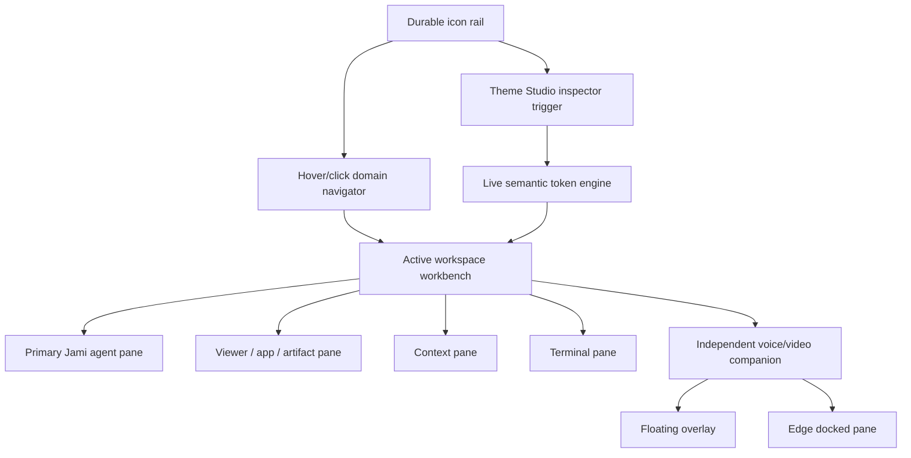
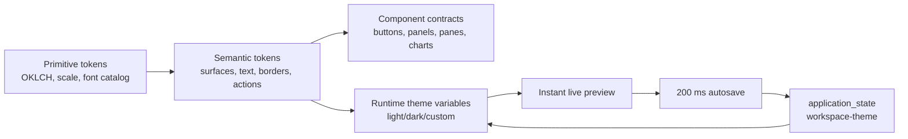

# Tokenized Workspace Shell — Design-Branch Build Mission

**Status:** Ready to build on the designated design branch  
**Date:** 2026-07-18  
**Work branch:** `design/workspace-shell-token-system` (create only when implementation begins)  
**Scope:** Full production-quality UI development for the shared workspace shell. This mission deliberately stops short of app migration, API redesign, and new database schema work.

## Outcome

Build the reusable Jami Studio workbench that future workspace apps inherit: one durable shell, one primary workspace chat, a flexible pane system, a real terminal/context surface, and an independent voice/video companion. Every visible surface must be driven by a first-class, live-editable token system.

The workbench must be visually complete and interactable before it is wired to every backend capability. It must not be a wireframe, a collection of route-local sidebars, or a demo-only layer. It is the shared UI foundation for the main workspace and all domain workspaces.

### Concrete target state

A user opens the full-suite workspace. A narrow rail remains present; hovering or clicking it reveals a concise domain tree. The central workbench holds the primary Jami agent thread and an active work pane. Context and terminal panes can be opened, split, resized, closed, restored, or focused. The voice/video companion floats above this work or docks to an edge without replacing the Jami chat. A small sliders control opens a right-side **Theme Studio** panel. Theme Studio is a dense, vertically grouped inspector with nested accordions, live preview, instant application, and continuous save; it is never a standalone page, a bottom drawer, or a half-screen sheet.

## Binding product decisions

These are resolved decisions for the design branch; they are not discussion prompts.

| Decision | Binding rule |
| --- | --- |
| Shell ownership | The workbench is the promoted Dispatch/workspace interaction surface, not an app wrapping a second chat product. |
| Navigation | A durable icon rail is always visible. Its domain navigation expands as a hover/click panel; it does not become a permanently wide application sidebar by default. |
| Primary chat | There is one Jami workspace-agent thread in the shell. App-specific chat chrome is not copied into the new shell. |
| Pane system | Chat, viewer, context, terminal, artifact, file/diff, and voice/video use one pane contract with explicit docked, floating, collapsed, focused, and closed states. |
| Voice/video | Voice/video is an independent companion surface. It is not rendered inside the Jami chat panel, does not own workspace tools, and does not take over navigation. |
| Visual customization | All reusable dimensions, typography, semantic colors, component variants, accents, charts, gradients, and motion derive from tokens. No shared component may carry a hard-coded visual value that ought to be a global token. |
| Theme Studio location | Theme controls live in one right-side inspector panel opened from the shell rail. Never use a full page, bottom drawer, or half-bottom drawer. |
| Persistence | Theme changes apply optimistically to CSS variables immediately and autosave, after a 200 ms debounce, to the existing `application_state` action surface. Local storage is only the fast bootstrap/offline mirror, never the cross-device source of truth. |
| Initial integration boundary | The branch may use existing chat, terminal, app registry, application-state, and realtime-voice interfaces. Every unavailable backend dependency receives a typed local fixture adapter; no new REST wrappers, schema, provider plumbing, or fake production API is introduced. |
| Accessibility | Keyboard navigation, focus restoration, minimum contrast, reduced motion, and screen-reader names are completed with the UI—not deferred polish. |

## Evidence and source materials

This mission builds from the following already-audited materials and code paths.

- [Workspace shell visual requirements](../../design-requirements/2026-07-17-workspace-shell-design-requirements.md) — extracted text and diagrams from `1.png`–`5.png`; this is the visual behavior reference for the rail, panes, docked/floating voice, calendar, terminal, and rich settings panel.
- [Unified workspace shell discussion](2026-07-17-unified-shell-and-sidebar-discussion.md) — establishes one workbench, a shell-level agent surface, shared same-origin workspace routing, and the pane fidelity ladder.
- `packages/toolkit/src/ui/resizable.tsx` — existing wrapper around `react-resizable-panels`; use it as the structural resize primitive.
- `packages/toolkit/src/ui/sidebar.tsx` — existing accessible sidebar and mobile behavior primitives; adapt its accessibility behavior, not its broad default chrome.
- `packages/core/src/client/AgentPanel.tsx` — existing agent-chat surface and mode ownership to extract behind a workbench pane adapter.
- `packages/core/src/client/terminal/AgentTerminal.tsx` — existing xterm-based terminal surface to host in the terminal pane.
- `packages/core/src/client/context-xray/ContextXRayPanel.tsx` — context inspection source surface.
- `packages/core/src/client/mcp-app-host.ts` — existing `inline`, `pip`, and `fullscreen` display vocabulary for artifact/card escalation.
- `packages/core/src/client/composer/RealtimeVoiceMode.tsx` and `useElevenLabsRealtimeVoiceMode.tsx` — independent realtime-voice state and dock UI to adapt into the shell-level voice/video surface.
- `packages/core/src/client/appearance.ts` and `packages/core/src/appearance/actions/change-appearance.ts` — the existing optimistic DOM + `application_state` synchronization pattern. It is a migration input, not the final six-preset appearance model.
- `templates/design/app/components/design/TokensPanel.tsx` and `TweaksPanel.tsx` — useful inline-token and immediate-feedback behavior. The new Theme Studio deliberately replaces the floating tweaks-panel placement with the required docked inspector flow.

## Logic inheritance ledger

The shell inherits only the proven behavior below. Anything not listed is excluded from this mission rather than quietly carried into the new surface.

| Area | Keep and adapt | Explicitly exclude from the new shell |
| --- | --- | --- |
| Workspace routing | Same-origin mounted-app URLs, `appRouterPath`, `isWithinAppBasePath`, browser history, and the discovered workspace app manifest. | A duplicate application registry, hard-coded localhost URLs, or route-local shell implementations. |
| Agent orchestration | Dispatch/workspace agent thread, actions as the shared capability surface, A2A discovery, and contextual cards. | Per-app competing agent panels and a voice agent issuing workspace tools directly. |
| Panes | Existing resizable primitives, portal/focus discipline, and the MCP card escalation vocabulary. | Ad hoc absolute-positioned layout engines, one-off drawer implementations, and app-specific layout state stores. |
| Terminal | `AgentTerminal`, xterm fit/link behavior, and the current PTY contract when available. | A second terminal emulator or a new command transport. |
| Context | Context X-Ray concepts and workspace/app/thread context. | Duplicated configuration/settings content scattered into every pane. |
| Voice/video | Realtime voice session lifecycle, transcript/event state, streaming indicators, and shell-level dock ownership. | Voice UI nested inside the Jami chat composer, direct tool execution by the voice companion, or call teardown on pane navigation. |
| Appearance | CSS-variable application, optimistic update, server synchronization, and application-state change notifications. | The current limited preset array as the global design system, raw per-component colors, and local-storage-only themes. |

## Workspace anatomy

### Required shell regions

| Region | Default behavior | Available states |
| --- | --- | --- |
| Durable rail | 48 px icon-only rail; tooltips on focus/hover; workspace switcher and Theme Studio trigger anchored here. | persistent, keyboard-focused |
| Domain navigator | Opens adjacent to the rail; groups `Business`, `Design`, `Research`, `Coding`, and `Full suite` with nested apps/tools. | closed, hover-open, keyboard-open, pinned |
| Workbench header | Compact breadcrumb/workspace identity, pane tabs, run presence, and only contextual controls. | normal, compact, hidden in focus mode |
| Primary Jami pane | Default center/left pane with transcript, shared composer, run status, and surfaceable results. | docked, split, focused, collapsed only when another pane is focused |
| Viewer pane | Generic host for app compatibility, artifact, calendar, file tree, diff, preview, and future sandbox views. | docked, split, focused, fullscreen-in-workbench, closed |
| Context pane | Inspector for selection, workspace/app/thread information, attachments, history, and relevant configuration summaries. | right dock, split, collapsed, floating inspector |
| Terminal pane | xterm surface with connection/status chrome and minimal command controls. | bottom dock, right split, focused, closed |
| Voice/video companion | Avatar/video tile, connection state, mic/output controls, optional read-only voice transcript, and handoff state. | floating compact, floating expanded, hard dock, soft dock, minimized bubble, closed |
| Theme Studio | Dedicated right-side, resizable inspector. It layers over or consumes a right pane; opening it never changes route. | closed, 360–440 px docked inspector, 320–480 px user-resized, temporarily pinned |

### Pane geometry and interaction contract

- The default desktop grid is `rail | primary Jami pane | viewer/context region`; terminal opens below its owning region.
- A pane can split only from an explicit pane menu or a drop target, never accidentally while dragging a divider.
- `focus` enlarges the selected pane inside the workbench while preserving rail and a reversible “restore layout” affordance.
- Pane dimensions use a tokenized min/preferred/max model. Persisted layout records store pane ids and normalized ratios, not pixels.
- The terminal defaults to a 30% bottom split; context defaults to a 28% right split; the voice companion defaults to a 300 px floating tile at lower right.
- Voice/video soft-docks beside a work pane and contracts that pane; hard-docks occupy a normal workbench pane. It does not cover the composer or terminal input.
- Every close, collapse, dock, undock, and focus action has a keyboard path and restores focus to the initiating control.

## Token system contract

The design system is a two-layer CSS-variable model shared by the shell and every future workspace app. Tailwind utilities consume the semantic layer; components never consume raw palette values.

### Token namespaces

| Namespace | Required controls | Examples |
| --- | --- | --- |
| `--ws-color-*` primitives | Hue, chroma, lightness, alpha, neutral family, contrast floor. | `--ws-color-accent`, `--ws-color-neutral-900` |
| `--ws-surface-*` semantics | Canvas, raised pane, sunken pane, overlay, inverse, border, scrim. | `--ws-surface-canvas`, `--ws-surface-panel` |
| `--ws-text-*` semantics | Primary, secondary, quiet, inverse, link, positive, warning, danger. | `--ws-text-primary` |
| `--ws-font-*` | UI, display, editorial, mono, terminal, pixel/technical, numeric. | `--ws-font-ui`, `--ws-font-mono` |
| `--ws-text-*` scale | Size, weight, line-height, tracking for display through microcopy. | `--ws-text-body-size`, `--ws-text-label-weight` |
| `--ws-space-*` | Base density and all spacing steps. | `--ws-space-1` through `--ws-space-12` |
| `--ws-radius-*` | Control, panel, overlay, media, pill. | `--ws-radius-panel` |
| `--ws-shadow-*` | Edge, floating, modal, focus, inset. | `--ws-shadow-overlay` |
| `--ws-control-*` | Button/input/toggle/segmented-control heights, padding, border, active state. | `--ws-control-md-height` |
| `--ws-pane-*` | Rail, navigator, context, theme studio, terminal, voice tile, divider. | `--ws-pane-theme-studio-width` |
| `--ws-chart-*` | Eight categorical series, sequential ramp, diverging ramp, grid, tooltip, selection. | `--ws-chart-series-1` |
| `--ws-gradient-*` | Accent wash, selection wash, chart fill, avatar/video edge. | `--ws-gradient-accent-subtle` |
| `--ws-motion-*` | Duration, easing, opacity, transform distance, reduced-motion equivalents. | `--ws-motion-panel-open` |

### Color, gradient, and chart derivation rules

- All editable colors use `oklch(L C H / A)`. Theme Studio exposes **lightness**, **chroma**, **hue**, and **alpha** directly; it also offers a text input for a valid CSS color for precise copying/import.
- A selected accent is the sole editable seed for accent-derived states. The runtime calculates `accent-subtle`, `accent-hover`, `accent-active`, `accent-border`, `accent-foreground`, focus ring, selection wash, and gradient stops from it against the current light or dark canvas.
- The contrast validator blocks an applied text/action pairing below WCAG AA for normal text (4.5:1) and shows the proposed correction before commit. Decorative gradients never carry required text.
- Categorical charts use a deterministic eight-step hue sequence beginning at the accent hue and rotating by 37°, with lightness/chroma adjusted by mode to maintain separation. Sequential and diverging ramps are generated from the same neutral/accent seeds. Charts therefore change with a custom theme without losing legibility.
- A gradient is always a named semantic token with a bounded recipe: two or three computed stops, a tokenized angle, and an opacity ceiling. Component code never invents one-off gradients.

### Theme packs and font packs

Ship these light/dark paired base packs on day one: **Slate, Stone, Zinc, Neutral, Mauve, Olive, Mist, and Taupe**. Each pack is a full semantic token map, not a recolored accent. The initial default is **Slate / Dark**, matching the quiet technical direction in the visual source.

Ship a curated, self-hosted font catalog rather than an uncontrolled font picker:

| Role | Initial choices | Default |
| --- | --- | --- |
| UI sans | Geist, Manrope, IBM Plex Sans, Public Sans | Geist |
| Display | Manrope, Fraunces, Newsreader | Manrope |
| Editorial/classic | Fraunces, Newsreader | Fraunces for explicitly editorial surfaces only |
| Mono / terminal | Geist Mono, IBM Plex Mono, JetBrains Mono, Commit Mono | Geist Mono |
| Pixel / technical | Departure Mono and one licensed, restrained pixel face selected at implementation after license verification | Departure Mono |

No script, faux-handwritten, childish, or decorative display font enters the catalog. The Theme Studio exposes role assignment; it does not allow a user to set arbitrary fonts on individual components.

## Theme Studio — required panel flow

Theme Studio is the required YRKA-style inspector flow generalized for the workbench. It follows the same compact, vertically aligned, nested-accordion behavior shown in the shell design references, while adding complete global tokens, contrast guidance, theme packs, and chart/motion control.

### Placement and chrome

- Entry point: `IconAdjustmentsHorizontal` in the bottom utility area of the durable rail, with the accessible name **Open Theme Studio**.
- Container: a right-side `<aside role="complementary">`, 360 px preferred width, resizable to 320–480 px, attached directly to the workbench edge.
- Opening behavior: pushes or overlays only the adjacent workbench region according to the current pane mode; it is never a route, dialog, sheet, modal, or bottom drawer.
- Header: theme name, dirty/saving/saved state, light/dark/system segmented control, undo/redo, overflow menu for duplicate/export/import/reset.
- Body: one scroll surface with compact, nested accordions. The active section stays visible in a sticky section path. Every numeric control supports drag, keyboard arrows, direct input, reset-to-inherited, and an inline live value.
- Footer: no permanent “Save” button. Show a compact `Saved just now` / `Saving…` state, plus an explicit **Publish to workspace** action only when sharing becomes available in a later backend slice.

### Exact accordion order

1. **Theme pack & mode** — pack picker, light/dark/system, base contrast, duplicate as custom theme.
2. **Accent & identity** — accent hue/chroma/lightness, focus ring, selection, status colors, avatar/video edge treatment.
3. **Surfaces & text** — canvas, rail, navigator, panes, overlays, borders, primary/secondary/quiet text, code surface.
4. **Typography** — role-based font pack, type scale multiplier, weights, tracking, line-height, numeric/tabular settings.
5. **Layout & density** — spacing multiplier, rail/navigator/pane widths, panel padding, radii, dividers, shadows.
6. **Controls & variants** — primary/secondary/quiet/danger button tokens, inputs, toggles, tabs, menus, focus rings, hover/pressed/disabled states.
7. **Charts & data** — categorical/sequential/diverging recipes, grid, tooltip, legend, selection, accessibility preview.
8. **Gradients & media** — accent washes, surface gradients, background treatment, video tile frame; no unbounded visual effects.
9. **Motion & accessibility** — panel/accordion/pane motion, reduction level, focus visibility, contrast report, transparency reduction.
10. **Themes & portability** — create/rename/duplicate/delete custom theme, reset scope, JSON import/export, inheritance source, last-saved metadata.

Each top-level accordion owns its nested controls. No second page, tab route, or hidden “advanced appearance” screen may duplicate these controls.

## Reusable UI building blocks

The design branch creates a stable workbench package surface before composing pages. Planned homes are intentionally specific so future apps import the same primitives.

| Planned module | Responsibility | Reuses |
| --- | --- | --- |
| `packages/toolkit/src/workbench/tokens.ts` | Typed token names, pack schemas, derivation inputs, validation. | Existing CSS-variable pattern and TypeScript conventions. |
| `packages/toolkit/src/workbench/theme.css` | Primitive, semantic, light/dark, and Tailwind `@theme inline` bridges. | Existing shared CSS pipeline. |
| `packages/toolkit/src/workbench/WorkspaceThemeProvider.tsx` | Optimistic apply, autosave queue, local bootstrap, `application_state` synchronization. | `applyAppearance`, `useAppearanceSync`, `writeAppState` action pattern. |
| `packages/toolkit/src/workbench/ThemeStudioPanel.tsx` | Required right-side inspector, accordion flow, token editor, preview, history. | Radix Accordion/Slider/Select/ScrollArea and toolkit controls. |
| `packages/toolkit/src/workbench/WorkbenchShell.tsx` | Rail, navigator, header, pane root, overlay layer, keyboard command boundaries. | Toolkit Sidebar, Tooltip, Popover, Dialog. |
| `packages/toolkit/src/workbench/PaneLayout.tsx` | Pane registry, split/focus/dock/restore state, normalized layout persistence. | `ResizablePanelGroup`, `ResizablePanel`, `ResizableHandle`. |
| `packages/toolkit/src/workbench/PaneFrame.tsx` | Shared pane titlebar, focus, close, split, dock, status, empty/error handling. | Tabler icons and shared buttons/menus. |
| `packages/toolkit/src/workbench/DomainNavigator.tsx` | Icon rail plus hierarchical workspace/domain/app/tool navigation. | Existing workspace app manifest and accessible navigation primitives. |
| `packages/toolkit/src/workbench/VoiceVideoCompanion.tsx` | Shell-level floating/docked/minimized companion UI. | Realtime voice state and existing dock controls. |
| `packages/dispatch/src/routes/workbench.tsx` | First composition route for the full-suite workbench. | Dispatch orchestration and workspace resource context. |

No new visual framework is introduced. The implementation uses existing `react-resizable-panels`, Radix/shadcn primitives, Tabler icons, xterm, assistant-ui, and the installed ElevenLabs client. Confirm the current package versions only if a dependency must be upgraded or added.

## UI states that must ship with the shell

Every listed region receives designed states, typed fixture data, and interaction tests. “Happy-path only” is incomplete.

| Surface | States |
| --- | --- |
| Rail/navigator | default, hover-open, keyboard-open, pinned, collapsed, empty domain, long label, permission-limited app, active app/workspace |
| Pane framework | first-run default, split horizontal, split vertical, resize, focus, restore, closed, loading, empty, recoverable error, too-narrow constraint |
| Jami chat | idle, composing, streaming, tool/run in progress, result card, history, error/retry, selected context chips |
| Terminal | disconnected, connecting, connected, command running, resize, error, no local runtime |
| Context | no selection, workspace summary, app summary, thread summary, artifact/file selection, long metadata, empty/error |
| Voice/video | unavailable, permission request, connecting, listening, speaking, muted, transcript hidden/shown, floating compact/expanded, soft dock, hard dock, minimized, connection/retry error |
| Theme Studio | closed, newly opened, autosaving, saved, validation warning, undo/redo, import preview, light/dark comparison, reduced motion, narrow panel, custom theme lifecycle |

## Integration boundary and adapters

The new UI becomes visually real without waiting for every system migration.

1. **Real from the start:** the existing workspace app discovery/navigation, Jami `AgentPanel` composition, `AgentTerminal` where a local PTY is present, Context X-Ray content, application-state theme persistence, and realtime-voice state when configured.
2. **Typed fixture adapters:** viewer artifacts, calendar data, project lists, remote terminal availability, video renderer, workspace status, and unavailable providers. Fixtures mimic production loading, empty, error, and long-content behavior but never masquerade as a live API.
3. **No new backend work in this mission:** no new tables, migrations, custom REST routes, provider credentials, provider-specific tool calls, cross-app data duplication, or rewrite of existing app actions.
4. **Later adapters:** app iframe compatibility panes, component-level app surfaces, shared/custom theme publication, remote shell/PTY, visual artifact backends, and production video provider handling plug into the pane registry without changing the shell’s visual contract.

### Voice and workspace-agent boundary

The workspace agent is the execution/orchestration owner. The voice/video companion captures and presents realtime conversation, forwards a structured intent to the workspace agent, and displays progress/results/transcript updates. The companion has no direct `navigate`, `call-agent`, or workspace tool capability. This preserves the A2A relationship: the workspace agent may use A2A to reach sibling agents; the voice layer does not impersonate that coordination layer.

## Implementation sequence

### Phase 0 — branch gate and baseline capture

1. Create `design/workspace-shell-token-system` from the approved current branch; do not merge unrelated upstream work into it.
2. Record visual baselines for all five source mock images, the current Dispatch shell, `AgentPanel`, terminal, Context X-Ray, realtime voice dock, and the existing appearance picker.
3. Freeze the inheritance ledger in this document as the code-review checklist. Any logic not in the ledger requires an explicit follow-up roadmap change before entering the branch.
4. Establish fixture data for every required UI state and seed browser test routes that run without provider credentials.

**Exit criterion:** review can point to one baseline for every retained behavior and one fixture for every planned pane state.

### Phase 1 — token foundation and theme runtime

1. Add the typed primitive/semantic token schemas and deterministic OKLCH derivation functions in `packages/toolkit/src/workbench/`.
2. Define all light/dark theme packs and Tailwind theme-variable bridges in a shared CSS entry. Replace visual literals in new workbench components with semantic tokens before those components are composed.
3. Build `WorkspaceThemeProvider` with optimistic DOM application, 200 ms debounced `application_state` save, server rehydration, local bootstrap mirror, error rollback, undo/redo stack, and theme import/export validation.
4. Create token fixtures that prove component, chart, and gradient output changes together when the accent, mode, density, or font pack changes.

**Exit criterion:** one runtime token change updates an isolated button, pane, chart, terminal theme, and voice tile immediately in both light and dark modes; a reload restores the selected custom theme through `application_state`.

### Phase 2 — shared workbench and pane framework

1. Build `WorkbenchShell`, `DomainNavigator`, `PaneLayout`, and `PaneFrame` from the toolkit primitives.
2. Implement the durable rail, nested domain/app/tool structure, workspace switcher, keyboard navigation, and concise status chrome.
3. Implement normalized layout persistence through existing `application_state`, including default restore, split, resize, close, focus, and reset-layout behavior.
4. Implement the generic viewer, context, terminal, artifact, and placeholder pane registrations with all required state fixtures.

**Exit criterion:** all planned panes can be created, split, resized, focused, closed, restored, and visually survive a reload with no route-local sidebar involved.

### Phase 3 — primary workspace surfaces

1. Adapt `AgentPanel` into a workbench-owned primary Jami pane while retaining the shared composer stack and current chat/run behavior.
2. Adapt `AgentTerminal` into a terminal pane with a token-derived xterm theme and designed unavailable/connecting/error states.
3. Adapt Context X-Ray into a context pane with fixtures for workspace, app, thread, selection, artifact, and file context.
4. Add the viewer’s first real adapters for the known workspace navigation and surfaceable result cards; leave unready data paths on typed fixtures.

**Exit criterion:** the main workspace feels complete through a realistic work session using chat, context, terminal, viewer, and navigation without depending on a per-app shell.

### Phase 4 — voice/video companion surface

1. Mount the companion at shell level, outside the Jami pane, with the existing realtime voice controller as the session source where configured.
2. Build compact/expanded floating, soft-docked, hard-docked, minimized, and reconnect/error states from one `VoiceVideoCompanion` component.
3. Add non-overlap rules for composer, terminal input, Theme Studio, modal layers, and narrow layouts. Preserve the session while the user changes pane focus or workspace route.
4. Surface only companion controls and read-only/live conversation context; no workspace tools or navigation controls are added to this component.

**Exit criterion:** switching panes, opening Theme Studio, resizing the workbench, and moving between supported workspace routes never visually or logically merge voice/video into the Jami chat.

### Phase 5 — Theme Studio panel

1. Build the right-side inspector with the exact accordion order and token control behavior specified above.
2. Use Radix/shadcn Accordion, Slider, Select, ScrollArea, Popover, Tooltip, ToggleGroup, and Dialog primitives; do not recreate controls with hand-positioned DOM.
3. Add live mini-previews for buttons, text hierarchy, panels, charts, terminal, and voice tile within the panel, plus a global live preview on the surrounding workbench.
4. Complete custom theme lifecycle, preset duplication, import/export, reset scopes, undo/redo, autosave feedback, invalid-token recovery, and contrast report.
5. Test that Theme Studio remains a side panel at every supported viewport. It must never fall back to a full route or bottom drawer.

**Exit criterion:** every requested visual dial is discoverable in Theme Studio, applies live, survives reload, and controls every workbench surface through tokens.

### Phase 6 — refinement, responsive fit, and design review

1. Refine density, typography, alignment, divider hierarchy, scroll fades, empty states, hover/focus behavior, and motion against the five source mock references.
2. Verify the workbench at wide desktop (1440+), laptop (1024–1439), and constrained desktop/tablet (768–1023). The side inspector remains a side panel; constrained layouts collapse secondary panes before changing Theme Studio’s placement.
3. Apply reduced-motion and high-contrast behavior without changing structural layout.
4. Remove temporary visual literals, duplicated panel chrome, generic dashboard cards, excessive helper text, and any “Save changes” workflow that conflicts with continuous save.

**Exit criterion:** design review approves every shell region and every Theme Studio group in both Slate light and Slate dark, then spot-checks one non-default pack and custom theme.

## Verification plan

- **Unit tests:** token derivation, OKLCH parser/validator, contrast guard, theme pack schema, autosave debounce/rollback, undo/redo, chart/gradient generation, pane layout normalization, and voice dock state reducer.
- **Component tests:** keyboard and focus behavior for rail, navigator, pane menu, resizer, Theme Studio accordion/controls, and voice companion; assert semantic roles and accessible names.
- **Visual regression:** capture each required shell and Theme Studio state in Slate light/dark, Stone light/dark, a custom accent theme, compact/wide layouts, and reduced-motion mode. Include a deliberate assertion that Theme Studio is a right-side `aside`, not a drawer/page.
- **Browser smoke:** open the workspace → open Domain Navigator → select an app/viewer fixture → split context → open terminal → focus/restore Jami pane → float then dock voice/video → open Theme Studio → change accent, font, density, and chart palette → reload → confirm layout/theme restore and active voice state remains separate from Jami chat.
- **Quality checks:** run formatting and affected package typechecks/tests; inspect browser screenshots for clipped panes, unreadable muted text, low contrast, accidental full-width cards, panel overlap, and broken keyboard order.

## Official implementation references

- [Tailwind CSS 4 theme variables](https://tailwindcss.com/docs/theme) — namespaced `@theme` variables, custom font/spacing/radius/shadow/easing utilities, and shareable CSS token files.
- [shadcn/ui theming](https://ui.shadcn.com/docs/theming) — semantic CSS variables, light/dark token mapping, radius scale, and supported base-color families.
- [shadcn/ui Resizable](https://ui.shadcn.com/docs/components/base/resizable) and [Sidebar](https://ui.shadcn.com/docs/components/base/sidebar) — current primitive integration guidance.
- [Radix Scroll Area](https://www.radix-ui.com/primitives/docs/components/scroll-area) — native-scroll-preserving custom scroll behavior and keyboard accessibility.
- [ElevenLabs Speech Engine](https://elevenlabs.io/docs/overview/capabilities/speech-engine) — the supported posture for adding voice to an existing chat/workspace agent while retaining server-side conversation control.

## Definition of done

The design branch is complete only when the full suite workspace presents a cohesive, reusable, token-driven UI with the entire shell, rail, domain navigator, pane system, primary agent chat, context, terminal, viewer states, independent voice/video companion, and Theme Studio panel implemented to production visual quality. It must be operable with fixtures when a backend is unavailable, must use live existing flows where already stable, and must prove that token changes update every surface immediately and persist across reloads.

App consolidation, migration of all existing app UIs, new provider/tool capabilities, new database tables, and production video-provider expansion remain intentionally outside this design-branch mission.
