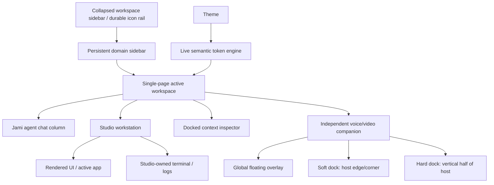
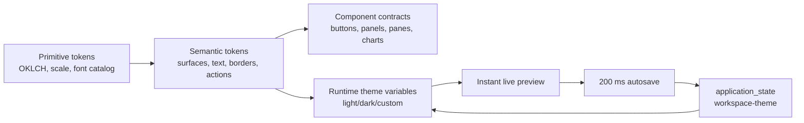

# Tokenized Workspace Shell — Design-Branch Build Mission

**Status:** Ready to build on the designated design branch  
**Date:** 2026-07-18  
**Work branch:** `design/workspace-shell-token-system` (create only when implementation begins)  
**Scope:** Full production-quality UI development for the shared workspace shell. This mission deliberately stops short of app migration, API redesign, and new database schema work.

## Outcome

Build the reusable Jami Studio workbench that future workspace apps inherit: one durable shell, one primary workspace chat, a composed Studio workstation with its own terminal/output, a docked context inspector, and an independent voice/video companion. Every visible surface must be driven by a first-class, live-editable token system.

The workbench must be visually complete and interactable before it is wired to every backend capability. It must not be a wireframe, a collection of route-local sidebars, or a demo-only layer. It is the shared UI foundation for the main workspace and all domain workspaces.

### Concrete target state

A user opens the full-suite workspace with the sidebar collapsed to its durable icon rail. Activating the rail opens the single domain sidebar, which stays open until the user closes, collapses, or hides it; hover is an optional quick-peek behavior, never the only way to use navigation. The sidebar contains a concise accordion tree for the selected workspace/domain, while inactive domains remain compact unless deliberately enabled. Its profile avatar/footer is permanently anchored to the bottom edge. The single-page workbench has a deliberate 1×2 composition: Jami agent chat beside a Studio workstation where the app/UI is rendered and used. The Studio workstation owns its terminal/log output directly below it, locked to the same column width. The docked context inspector and the open sidebar push the composition inward; neither overlays or covers active work. Voice/video is a topmost global companion when floating; only its explicit hard- and soft-dock states reserve space within an allowed host region. It never replaces the Jami chat. The profile menu contains the **Theme Studio** trigger; Theme Studio then occupies the docked context-inspector surface. It is a dense, vertically grouped inspector with nested accordions, live preview, instant application, and continuous save; it is never a standalone page, a bottom drawer, or a half-screen sheet.

## Binding product decisions

These are resolved decisions for the design branch; they are not discussion prompts.

| Decision | Binding rule |
| --- | --- |
| Shell ownership | The workbench is the promoted Dispatch/workspace interaction surface, not an app wrapping a second chat product. |
| Navigation | The durable icon rail is the collapsed state of the one configurable workspace sidebar. Its full domain panel is closed by default, persists when opened, and may use hover only as an optional quick-peek. It holds the full nested domain/app/tool tree; a second sidebar is never introduced. |
| Primary chat | There is one Jami workspace-agent thread in the shell. App-specific chat chrome is not copied into the new shell. |
| Workspace regions | The shell has named regions—main work surface, agent chat, context, terminal, and voice/video—not an unrestricted IDE tile manager. Users choose visibility and the allowed dock/float state of each region; they do not assemble arbitrary nested split trees. |
| Studio workstation | The main work surface and its terminal/log output form one vertical workstation. The terminal is width-locked to the Studio above it; it never spans the chat column or the entire shell. A 1×2 layout may contain multiple Studio workstations, each with its own terminal/output below. |
| Dock behavior | Opening the sidebar or context inspector resizes/pushes the workstation composition. These docked surfaces never overlay or cover chat, Studio content, or terminal input. |
| Voice/video | Voice/video is an independent companion surface. In its floating and minimized states it is a topmost global overlay, outside the normal workstation geometry. Only its explicit hard- and soft-dock states consume space in an allowed host region. It is not rendered inside the Jami chat panel, does not own workspace tools, and does not take over navigation. |
| Voice/video docking | Floating is free movement and bounded resize over the shell. Soft dock gives the companion a stable edge/corner home attached to Jami chat or the context inspector. Hard dock gives it one vertical half of Jami chat or context, with the host content using the other half. No arbitrary dock target or generic pane-tree mutation is allowed. |
| Visual customization | All reusable dimensions, typography, semantic colors, component variants, accents, charts, gradients, and motion derive from tokens. No shared component may carry a hard-coded visual value that ought to be a global token. |
| Theme Studio location | Theme controls are opened from the profile menu and live inside the one right-side context-inspector surface. Never use a full page, bottom drawer, half-bottom drawer, or a dedicated sidebar icon. |
| Persistence | Theme changes apply optimistically to CSS variables immediately and autosave, after a 200 ms debounce, to the existing `application_state` action surface. Local storage is only the fast bootstrap/offline mirror, never the cross-device source of truth. |
| Initial integration boundary | The branch may use existing chat, terminal, app registry, application-state, and realtime-voice interfaces. Every unavailable backend dependency receives a typed local fixture adapter; no new REST wrappers, schema, provider plumbing, or fake production API is introduced. |
| Accessibility | Keyboard navigation, focus restoration, minimum contrast, reduced motion, and screen-reader names are completed with the UI—not deferred polish. |

## Evidence and source materials

This mission builds from the following already-audited materials and code paths.

- [Workspace shell visual requirements](../../design-requirements/2026-07-17-workspace-shell-design-requirements.md) — extracted text and diagrams from `1.png`–`5.png`; this is the visual behavior reference for the rail, panes, docked/floating voice, calendar, terminal, and rich settings panel.
- [Unified workspace shell discussion](2026-07-17-unified-shell-and-sidebar-discussion.md) — establishes one workbench, a shell-level agent surface, shared same-origin workspace routing, and the pane fidelity ladder.
- `packages/toolkit/src/ui/resizable.tsx` — existing wrapper around `react-resizable-panels`; use it as the structural resize primitive.
- `packages/toolkit/src/ui/sidebar.tsx` — existing accessible sidebar and mobile behavior primitives; adapt its accessibility behavior, not its broad default chrome.
- `packages/core/src/client/AgentPanel.tsx` — existing agent-chat surface and mode ownership to extract behind a workbench pane adapter.
- `packages/core/src/client/terminal/AgentTerminal.tsx` — existing xterm-based terminal surface to host in the terminal pane.
- `packages/core/src/client/context-xray/ContextXRayPanel.tsx` — context inspection source surface.
- `packages/core/src/client/mcp-app-host.ts` — existing `inline`, `pip`, and `fullscreen` display vocabulary for artifact/card escalation.
- `packages/core/src/client/composer/RealtimeVoiceMode.tsx` and `useElevenLabsRealtimeVoiceMode.tsx` — independent realtime-voice state and dock UI to adapt into the shell-level voice/video surface.
- `packages/core/src/client/appearance.ts` and `packages/core/src/appearance/actions/change-appearance.ts` — the existing optimistic DOM + `application_state` synchronization pattern. It is a migration input, not the final six-preset appearance model.
- `templates/design/app/components/design/TokensPanel.tsx` and `TweaksPanel.tsx` — useful inline-token and immediate-feedback behavior. The new Theme Studio deliberately replaces the floating tweaks-panel placement with the required docked inspector flow.

## Logic inheritance ledger

The shell inherits only the proven behavior below. Anything not listed is excluded from this mission rather than quietly carried into the new surface.

| Area | Keep and adapt | Explicitly exclude from the new shell |
| --- | --- | --- |
| Workspace routing | Same-origin mounted-app URLs, `appRouterPath`, `isWithinAppBasePath`, browser history, and the discovered workspace app manifest. | A duplicate application registry, hard-coded localhost URLs, or route-local shell implementations. |
| Agent orchestration | Dispatch/workspace agent thread, actions as the shared capability surface, A2A discovery, and contextual cards. | Per-app competing agent panels and a voice agent issuing workspace tools directly. |
| Panes | Existing resizable primitives, portal/focus discipline, and the MCP card escalation vocabulary. | Ad hoc absolute-positioned layout engines, one-off drawer implementations, and app-specific layout state stores. |
| Terminal | `AgentTerminal`, xterm fit/link behavior, and the current PTY contract when available. | A second terminal emulator or a new command transport. |
| Context | Context X-Ray concepts and workspace/app/thread context. | Duplicated configuration/settings content scattered into every pane. |
| Voice/video | Realtime voice session lifecycle, transcript/event state, streaming indicators, and shell-level dock ownership. | Voice UI nested inside the Jami chat composer, direct tool execution by the voice companion, or call teardown on pane navigation. |
| Appearance | CSS-variable application, optimistic update, server synchronization, and application-state change notifications. | The current limited preset array as the global design system, raw per-component colors, and local-storage-only themes. |

## Workspace anatomy

### Required shell regions

| Region | Default behavior | Available states |
| --- | --- | --- |
| Collapsed sidebar rail | 48 px icon-only collapsed sidebar; tooltips on focus/hover; workspace switcher and navigation only. | persistent, keyboard-focused |
| Domain sidebar | The one persistent navigation sidebar. It opens from the rail and groups `Business`, `Design`, `Research`, `Coding`, and `Full suite` in nested accordions. | panel closed, collapsed rail, quick-peek hover, open persistent, keyboard-open |
| Sidebar footer | Profile avatar, account/workspace controls, and small utility actions occupy a bottom-anchored, non-scrolling region. | always bottom-anchored, compact, expanded account menu |
| Workbench header | Compact breadcrumb/workspace identity, active work title, run presence, and only contextual controls. | normal, compact, hidden in focus mode |
| Jami agent column | Workspace-agent transcript, shared composer, run status, and surfaceable results. | visible, compact, hidden, focus mode |
| Studio workstation | The active app, artifact, calendar, file tree, diff, preview, or future sandbox view with its own output below. | default, loading, empty, error, focus mode |
| Studio terminal/output | xterm/log surface directly under and width-locked to its Studio workstation. It shares the Studio column’s edge and resize behavior. | closed, compact, expanded, connecting, running, error |
| Context inspector | The one docked inspector surface for selection, workspace/app/thread information, attachments, history, relevant configuration summaries, and Theme Studio. | closed, right dock, compact, expanded, Theme Studio |
| Voice/video companion | A shell-portalled avatar/video tile, connection state, mic/output controls, one-line manual input, read-only/live transcript, and handoff state. Floating states remain above every shell and app surface; dock states attach only to Jami chat or the context inspector. | floating compact/expanded and bounded resize, soft dock, hard vertical-half dock, minimized bubble, closed |
| Theme Studio | A mode/content view of the right-side context inspector, entered from the profile menu; it never creates a second inspector. | closed, context-inspector Theme Studio, 360–440 px docked inspector, 320–480 px user-resized, temporarily pinned |

### Sidebar and workspace-region contract

- The sidebar and rail are one component with three durable modes: `panel-closed`, `collapsed-rail`, and `open`. The full domain panel is closed by default behind the durable rail; users may save an open preference or hide the rail where their workspace configuration allows it.
- The open sidebar is a real persistent sidebar, not a transient hover menu. Hover may temporarily expose it from the rail, but a click or keyboard activation keeps it open.
- All domain/app/tool rows are nested accordion items and start collapsed. The selected domain opens first; inactive domains remain collapsed unless the user chooses an “all domains open” preference.
- Users can hide, reorder, and restore sidebar sections/items without disabling the underlying application. Hidden means absent from navigation chrome, not unavailable to command search, deep links, or the workspace agent.
- The main sidebar body is a flex scroll region. It grows and scrolls inside the space above the permanently bottom-anchored profile/avatar footer; content never pushes the footer down, opens over it, or creates a second footer.
- Sidebar active and hover states use quiet text/color changes, a restrained active fill, and tokenized focus rings. No animated decoration, large layout jump, or competing hover treatment is permitted.
- The workbench uses composed workstation regions instead of a freeform pane tree: `agent`, `studio`, `studio-output`, `context`, and `voice-video`. Each has a small, explicit set of allowed positions; only its own divider may resize it.
- The default desktop composition is `sidebar rail | Jami agent column | Studio workstation`, with the Studio-owned terminal/output directly below the Studio. The optional context inspector docks at the right. A workspace layout records visibility and normalized sizes for these named regions, not a recursive pane graph.
- Opening the sidebar or context inspector pushes the entire working composition inward; neither surface overlays or covers another working region. Closing either returns its width to the composition.
- The Studio work surface can enter focus mode; voice/video may float, soft-dock, hard-dock, minimize, or close. Every Studio workstation owns its terminal/output beneath it, so terminal/log output never spans unrelated workstations. No generic drag-to-split or arbitrary reparenting is part of this mission.
- The visual system uses one dark outer shell with a restrained tokenized gap and small, consistent radius around the primary columns and stacked Studio/output pair. Region boundaries are the only structural containers: controls, transcripts, images, streamed text, and compact status indicators remain visually direct rather than receiving decorative cards or wrappers.
- Every hide, show, resize, dock, undock, and focus action has a keyboard path and restores focus to the initiating control.

### Voice/video global-overlay and dock contract

- Floating voice/video is rendered in a shell-level portal above every workbench and app surface. It remains available across navigation and Studio focus changes; its global floating layer is the deliberate exception to the sidebar/context push-in rule.
- A floating companion supports compact and expanded presentations, horizontal/vertical drag, and bounded resizing. Its maximum footprint is intentionally modest (approximately one quarter of the viewport) so the active Studio remains usable.
- A soft dock is a stable, remembered home attached to an allowed host: the Jami chat or context inspector. It may sit at an allowed host edge/corner; a top or bottom soft dock occupies half of that host's available vertical space. It flexes with the host width, resizes vertically, and collapses/reopens through the same host-panel control path.
- A hard dock divides only the Jami chat or context inspector into a vertical half for voice/video and a remaining half for the host content. It does not consume the Studio canvas or its terminal/output, and it is not a generic dock target.
- If Jami chat is closed while the companion is shown, reopening chat restores its normal shell location and restores the companion to the supported pinned-half arrangement rather than merging voice/video into chat. The companion session and transcript survive this layout transition.
- The companion provides streaming state, start/end session, mute, a compact manual text line, and a scrollable transcript with restrained edge fades. It presents handoffs and results from the workspace agent but never renders workspace navigation or tool controls.

### App-specific component composition

The shell is the common host for **every** workspace app. It supplies shared navigation, agent chat, Studio/terminal ownership, context, voice/video, persistence, accessibility, and tokens. It must not turn all apps into the same generic dashboard or tile layout. Each app inherits the shell and then presents the task-appropriate primary composition it actually needs: calendar, mail, research, design, coding, operations, or any future domain.

Calendar is only the reference example. Its biweekly calendar above an hourly schedule shows two coordinated views inside one scheduling app component, not two new shell regions and not a rule that other apps must resemble it. Every app receives the same ability to compose intentional internal views inside the Studio host, using shared tokens and reusable primitives without app-specific shell chrome or layout stores.

When any app is active, the global voice companion may float above its content, while a hard- or soft-docked companion occupies only the defined chat/context host relationship. Opening the far-right context inspector still pushes the overall workbench inward. Internal app views inherit the same restrained outer radius, gap, and token system, without decorative wrappers around small controls, transcripts, images, or task-specific cells.

## Token system contract

The design system is a two-layer CSS-variable model shared by the shell and every future workspace app. Tailwind utilities consume the semantic layer; components never consume raw palette values.

### Token namespaces

| Namespace | Required controls | Examples |
| --- | --- | --- |
| `--ws-color-*` primitives | Hue, chroma, lightness, alpha, neutral family, contrast floor. | `--ws-color-accent`, `--ws-color-neutral-900` |
| `--ws-surface-*` semantics | Canvas, raised pane, sunken pane, overlay, inverse, border, scrim. | `--ws-surface-canvas`, `--ws-surface-panel` |
| `--ws-text-*` semantics | Primary, secondary, quiet, inverse, link, positive, warning, danger. | `--ws-text-primary` |
| `--ws-font-*` | UI, display, editorial, mono, terminal, pixel/technical, numeric. | `--ws-font-ui`, `--ws-font-mono` |
| `--ws-text-*` scale | Size, weight, line-height, tracking for display through microcopy. | `--ws-text-body-size`, `--ws-text-label-weight` |
| `--ws-space-*` | Base density and all spacing steps. | `--ws-space-1` through `--ws-space-12` |
| `--ws-radius-*` | Control, panel, overlay, media, pill. | `--ws-radius-panel` |
| `--ws-shadow-*` | Edge, floating, modal, focus, inset. | `--ws-shadow-overlay` |
| `--ws-control-*` | Button/input/toggle/segmented-control heights, padding, border, active state. | `--ws-control-md-height` |
| `--ws-pane-*` | Rail, navigator, context, theme studio, terminal, voice tile, divider. | `--ws-pane-theme-studio-width` |
| `--ws-chart-*` | Eight categorical series, sequential ramp, diverging ramp, grid, tooltip, selection. | `--ws-chart-series-1` |
| `--ws-gradient-*` | Accent wash, selection wash, chart fill, avatar/video edge. | `--ws-gradient-accent-subtle` |
| `--ws-motion-*` | Duration, easing, opacity, transform distance, reduced-motion equivalents. | `--ws-motion-panel-open` |

### Color, gradient, and chart derivation rules

- All editable colors use `oklch(L C H / A)`. Theme Studio exposes **lightness**, **chroma**, **hue**, and **alpha** directly; it also offers a text input for a valid CSS color for precise copying/import.
- A selected accent is the sole editable seed for accent-derived states. The runtime calculates `accent-subtle`, `accent-hover`, `accent-active`, `accent-border`, `accent-foreground`, focus ring, selection wash, and gradient stops from it against the current light or dark canvas.
- The contrast validator blocks an applied text/action pairing below WCAG AA for normal text (4.5:1) and shows the proposed correction before commit. Decorative gradients never carry required text.
- Categorical charts use a deterministic eight-step hue sequence beginning at the accent hue and rotating by 37°, with lightness/chroma adjusted by mode to maintain separation. Sequential and diverging ramps are generated from the same neutral/accent seeds. Charts therefore change with a custom theme without losing legibility.
- A gradient is always a named semantic token with a bounded recipe: two or three computed stops, a tokenized angle, and an opacity ceiling. Component code never invents one-off gradients.

### Theme packs and font packs

Ship these light/dark paired base packs on day one: **Slate, Stone, Zinc, Neutral, Mauve, Olive, Mist, and Taupe**. Each pack is a full semantic token map, not a recolored accent. The initial default is **Slate / Dark**, matching the quiet technical direction in the visual source.

Ship a curated, self-hosted font catalog rather than an uncontrolled font picker:

| Role | Initial choices | Default |
| --- | --- | --- |
| UI sans | Geist, Manrope, IBM Plex Sans, Public Sans | Geist |
| Display | Manrope, Fraunces, Newsreader | Manrope |
| Editorial/classic | Fraunces, Newsreader | Fraunces for explicitly editorial surfaces only |
| Mono / terminal | Geist Mono, IBM Plex Mono, JetBrains Mono, Commit Mono | Geist Mono |
| Pixel / technical | Departure Mono and one licensed, restrained pixel face selected at implementation after license verification | Departure Mono |

No script, faux-handwritten, childish, or decorative display font enters the catalog. The Theme Studio exposes role assignment; it does not allow a user to set arbitrary fonts on individual components.

## Theme Studio — required panel flow

Theme Studio is the required YRKA-style inspector flow generalized for the workbench. It follows the same compact, vertically aligned, nested-accordion behavior shown in the shell design references, while adding complete global tokens, contrast guidance, theme packs, and chart/motion control.

### Placement and chrome

- Entry point: `IconAdjustmentsHorizontal` in the profile/account menu, with the accessible name **Open Theme Studio**. It is not a durable-rail/sidebar icon.
- Container: a right-side `<aside role="complementary">` supplied by the existing context inspector, 360 px preferred width and resizable to 320–480 px. Theme Studio is a context-inspector mode, not a second right-side panel.
- Opening behavior: opens the Theme Studio content in the docked context inspector, or opens that inspector directly into Theme Studio; it pushes the adjacent workstation composition inward and never overlays active work. It is never a route, dialog, sheet, modal, or bottom drawer.
- Header: theme name, dirty/saving/saved state, light/dark/system segmented control, undo/redo, overflow menu for duplicate/export/import/reset.
- Body: one scroll surface with compact, nested accordions. The active section stays visible in a sticky section path. Every numeric control supports drag, keyboard arrows, direct input, reset-to-inherited, and an inline live value.
- Footer: no permanent “Save” button. Show a compact `Saved just now` / `Saving…` state, plus an explicit **Publish to workspace** action only when sharing becomes available in a later backend slice.

### Exact accordion order

1. **Theme pack & mode** — pack picker, light/dark/system, base contrast, duplicate as custom theme.
2. **Accent & identity** — accent hue/chroma/lightness, focus ring, selection, status colors, avatar/video edge treatment.
3. **Surfaces & text** — canvas, rail, navigator, panes, overlays, borders, primary/secondary/quiet text, code surface.
4. **Typography** — role-based font pack, type scale multiplier, weights, tracking, line-height, numeric/tabular settings.
5. **Layout & density** — spacing multiplier, rail/navigator/pane widths, panel padding, radii, dividers, shadows.
6. **Controls & variants** — primary/secondary/quiet/danger button tokens, inputs, toggles, tabs, menus, focus rings, hover/pressed/disabled states.
7. **Charts & data** — categorical/sequential/diverging recipes, grid, tooltip, legend, selection, accessibility preview.
8. **Gradients & media** — accent washes, surface gradients, background treatment, video tile frame; no unbounded visual effects.
9. **Motion & accessibility** — panel/accordion/pane motion, reduction level, focus visibility, contrast report, transparency reduction.
10. **Themes & portability** — create/rename/duplicate/delete custom theme, reset scope, JSON import/export, inheritance source, last-saved metadata.

Each top-level accordion owns its nested controls. No second page, tab route, or hidden “advanced appearance” screen may duplicate these controls.

## Reusable UI building blocks

The design branch creates a stable workbench package surface before composing pages. Planned homes are intentionally specific so future apps import the same primitives.

| Planned module | Responsibility | Reuses |
| --- | --- | --- |
| `packages/toolkit/src/workbench/tokens.ts` | Typed token names, pack schemas, derivation inputs, validation. | Existing CSS-variable pattern and TypeScript conventions. |
| `packages/toolkit/src/workbench/theme.css` | Primitive, semantic, light/dark, and Tailwind `@theme inline` bridges. | Existing shared CSS pipeline. |
| `packages/toolkit/src/workbench/WorkspaceThemeProvider.tsx` | Optimistic apply, autosave queue, local bootstrap, `application_state` synchronization. | `applyAppearance`, `useAppearanceSync`, `writeAppState` action pattern. |
| `packages/toolkit/src/workbench/ThemeStudioPanel.tsx` | Required right-side inspector, accordion flow, token editor, preview, history. | Radix Accordion/Slider/Select/ScrollArea and toolkit controls. |
| `packages/toolkit/src/workbench/WorkbenchShell.tsx` | Unified sidebar/rail, header, single-page workstation root, overlay layer, keyboard command boundaries. | Toolkit Sidebar, Tooltip, Popover, Dialog. |
| `packages/toolkit/src/workbench/WorkspaceRegions.tsx` | 1×2 workstation composition, Studio/output pairing, inspector/sidebar push behavior, allowed docking, focus, and normalized layout persistence. | `ResizablePanelGroup`, `ResizablePanel`, `ResizableHandle`. |
| `packages/toolkit/src/workbench/RegionFrame.tsx` | Shared region titlebar, focus, close, allowed dock state, status, empty/error handling. | Tabler icons and shared buttons/menus. |
| `packages/toolkit/src/workbench/WorkspaceSidebar.tsx` | One configurable sidebar with collapsed rail, persistent/quick-peek behavior, accordion tree, and fixed profile footer. | Existing workspace app manifest, Radix Accordion, and accessible navigation primitives. |
| `packages/toolkit/src/workbench/VoiceVideoCompanion.tsx` | Shell-level floating/docked/minimized companion UI. | Realtime voice state and existing dock controls. |
| `packages/dispatch/src/routes/workbench.tsx` | First composition route for the full-suite workbench. | Dispatch orchestration and workspace resource context. |

No new visual framework is introduced. The implementation uses existing `react-resizable-panels`, Radix/shadcn primitives, Tabler icons, xterm, assistant-ui, and the installed ElevenLabs client. Confirm the current package versions only if a dependency must be upgraded or added.

## UI states that must ship with the shell

Every listed region receives designed states, typed fixture data, and interaction tests. “Happy-path only” is incomplete.

| Surface | States |
| --- | --- |
| Sidebar/rail | hidden, collapsed rail, hover quick-peek, persistent open, keyboard-open, empty domain, long label, permission-limited app, active app/workspace, scrolling body with fixed profile footer |
| Workstation composition | first-run 1×2 layout, Studio/output width lock, sidebar/context push-in, allowed resize, focus Studio, restore, closed secondary region, loading, empty, recoverable error, too-narrow constraint |
| Jami chat | idle, composing, streaming, tool/run in progress, result card, history, error/retry, selected context chips, visible/compact/hidden region |
| Terminal | disconnected, connecting, connected, command running, resize, error, no local runtime |
| Context | no selection, workspace summary, app summary, thread summary, artifact/file selection, long metadata, empty/error |
| Voice/video | unavailable, permission request, connecting, listening, speaking, muted, transcript hidden/shown, floating compact/expanded, drag/resize bounds, soft dock at every allowed host placement, hard vertical-half dock, host collapse/reopen restoration, Jami chat hide/show restoration, minimized, connection/retry error |
| Theme Studio | closed, newly opened, autosaving, saved, validation warning, undo/redo, import preview, light/dark comparison, reduced motion, narrow panel, custom theme lifecycle |

## Integration boundary and adapters

The new UI becomes visually real without waiting for every system migration.

1. **Real from the start:** the existing workspace app discovery/navigation, Jami `AgentPanel` composition, `AgentTerminal` where a local PTY is present, Context X-Ray content, application-state theme persistence, and realtime-voice state when configured.
2. **Typed fixture adapters:** representative primary surfaces for every app/domain (including calendar scheduling data as one example), viewer artifacts, project lists, remote terminal availability, video renderer, workspace status, and unavailable providers. Fixtures mimic production loading, empty, error, and long-content behavior but never masquerade as a live API.
3. **No new backend work in this mission:** no new tables, migrations, custom REST routes, provider credentials, provider-specific tool calls, cross-app data duplication, or rewrite of existing app actions.
4. **Later adapters:** app iframe compatibility surfaces, component-level app surfaces, shared/custom theme publication, remote shell/PTY, visual artifact backends, and production video provider handling plug into the named-region contract without changing the shell’s visual contract.

### Voice and workspace-agent boundary

The workspace agent is the execution/orchestration owner. The voice/video companion captures and presents realtime conversation, forwards a structured intent to the workspace agent, and displays progress/results/transcript updates. The companion has no direct `navigate`, `call-agent`, or workspace tool capability. This preserves the A2A relationship: the workspace agent may use A2A to reach sibling agents; the voice layer does not impersonate that coordination layer.

## Implementation sequence

### Phase 0 — branch gate and baseline capture

1. Create `design/workspace-shell-token-system` from the approved current branch; do not merge unrelated upstream work into it.
2. Record visual baselines for all five source mock images, the current Dispatch shell, `AgentPanel`, terminal, Context X-Ray, realtime voice dock, and the existing appearance picker.
3. Freeze the inheritance ledger in this document as the code-review checklist. Any logic not in the ledger requires an explicit follow-up roadmap change before entering the branch.
4. Establish fixture data for every required UI state and seed browser test routes that run without provider credentials.

**Exit criterion:** review can point to one baseline for every retained behavior and one fixture for every planned named-region state.

### Phase 1 — token foundation and theme runtime

1. Add the typed primitive/semantic token schemas and deterministic OKLCH derivation functions in `packages/toolkit/src/workbench/`.
2. Define all light/dark theme packs and Tailwind theme-variable bridges in a shared CSS entry. Replace visual literals in new workbench components with semantic tokens before those components are composed.
3. Build `WorkspaceThemeProvider` with optimistic DOM application, 200 ms debounced `application_state` save, server rehydration, local bootstrap mirror, error rollback, undo/redo stack, and theme import/export validation.
4. Create token fixtures that prove component, chart, and gradient output changes together when the accent, mode, density, or font pack changes.

**Exit criterion:** one runtime token change updates an isolated button, workspace region, chart, terminal theme, and voice tile immediately in both light and dark modes; a reload restores the selected custom theme through `application_state`.

### Phase 2 — shared workbench and named-region framework

1. Build `WorkbenchShell`, `WorkspaceSidebar`, `WorkspaceRegions`, and `RegionFrame` from the toolkit primitives.
2. Implement the one sidebar: durable collapsed rail, persistent open/sidebar mode, optional hover quick-peek, nested domain/app/tool accordions, workspace switcher, per-user section visibility/order, fixed profile footer, keyboard navigation, and concise status chrome.
3. Implement the single-page 1×2 workstation composition: Jami chat beside Studio, terminal/output locked beneath Studio, and a right context inspector. Sidebar and context transitions must resize/push this composition rather than overlay it.
4. Implement normalized workstation-layout persistence through existing `application_state`, including default restore, visibility, allowed resize, focus-Studio, dock state, and reset-layout behavior.
5. Implement the Studio work surface plus context, terminal, and placeholder region adapters with all required state fixtures.

**Exit criterion:** the one sidebar behaves correctly in hidden, collapsed-rail, quick-peek, and persistent-open modes; the Jami/Studio 1×2 layout, Studio-owned output, and push-in context inspector survive a reload without a route-local sidebar or any overlay collision.

### Phase 3 — primary workspace surfaces

1. Adapt `AgentPanel` into the workbench-owned primary Jami region while retaining the shared composer stack and current chat/run behavior.
2. Adapt `AgentTerminal` into the Studio-owned output region below the Studio, with a token-derived xterm theme and designed unavailable/connecting/error states.
3. Adapt Context X-Ray into the right docked context inspector with fixtures for workspace, app, thread, selection, artifact, and file context.
4. Add the viewer’s first real adapters for the known workspace navigation and surfaceable result cards; leave unready data paths on typed fixtures.

**Exit criterion:** the main workspace feels complete through a realistic work session using chat, context, terminal, viewer, and navigation without depending on a per-app shell.

### Phase 4 — voice/video companion surface

1. Mount `VoiceVideoCompanion` once in a shell-level portal, outside the Jami pane and normal workstation layout, with the existing realtime voice controller as its session source where configured. Floating and minimized companion states must stay topmost across workspace navigation.
2. Implement one explicit state reducer for compact/expanded floating, soft dock, hard vertical-half dock, minimized, closed, unavailable, connecting, listening, speaking, and retry/error states. Persist only the allowed host, placement, and normalized size—never a freeform pane tree.
3. Implement floating drag and bounded resize; implement soft-dock homes at allowed Jami-chat/context edges or corners; implement hard dock as the defined vertical half split of Jami chat or context. Top/bottom soft docks take half of their host's vertical space and flex with its width.
4. Couple visibility transitions correctly: when a host collapses, its soft-docked companion follows and reopens through that host's trigger; when Jami chat returns from hidden, it takes its normal shell position and the companion restores the supported pinned-half placement. Preserve voice session and transcript through every layout change.
5. Add collision and narrow-layout behavior for composer, terminal input, Theme Studio, and modal layers without demoting the companion's global layer. Surface only companion controls, manual input, and read-only/live conversation context; no workspace tools or navigation controls are added to this component.

**Exit criterion:** floating voice/video remains a coherent global layer across routes; every allowed soft/hard dock restores predictably with its host; Jami chat, Studio, terminal, and context retain their respective responsibilities; no transition visually or logically merges voice/video into the Jami chat.

### Phase 5 — Theme Studio panel

1. Build the Theme Studio mode inside the right-side context inspector with the exact accordion order and token control behavior specified above; expose its entry only through the profile/account menu.
2. Use Radix/shadcn Accordion, Slider, Select, ScrollArea, Popover, Tooltip, ToggleGroup, and Dialog primitives; do not recreate controls with hand-positioned DOM.
3. Add live mini-previews for buttons, text hierarchy, panels, charts, terminal, and voice tile within the panel, plus a global live preview on the surrounding workbench.
4. Complete custom theme lifecycle, preset duplication, import/export, reset scopes, undo/redo, autosave feedback, invalid-token recovery, and contrast report.
5. Test that Theme Studio remains the context inspector's side-panel mode at every supported viewport. It must never become a second panel or fall back to a full route or bottom drawer.

**Exit criterion:** every requested visual dial is discoverable in Theme Studio, applies live, survives reload, and controls every workbench surface through tokens.

### Phase 6 — refinement, responsive fit, and design review

1. Refine density, typography, alignment, divider hierarchy, scroll fades, empty states, hover/focus behavior, and motion against the five source mock references.
2. Verify the workbench at wide desktop (1440+), laptop (1024–1439), and constrained desktop/tablet (768–1023). The side inspector remains a side panel; constrained layouts collapse secondary panes before changing Theme Studio’s placement.
3. Apply reduced-motion and high-contrast behavior without changing structural layout.
4. Remove temporary visual literals, duplicated panel chrome, generic dashboard cards, excessive helper text, and any “Save changes” workflow that conflicts with continuous save.

**Exit criterion:** design review approves every shell region and every Theme Studio group in both Slate light and Slate dark, then spot-checks one non-default pack and custom theme.

## Verification plan

- **Unit tests:** token derivation, OKLCH parser/validator, contrast guard, theme pack schema, autosave debounce/rollback, undo/redo, chart/gradient generation, workstation-layout normalization, Studio/output width lock, inspector push-in calculation, and the voice companion state reducer (floating bounds, allowed host placement, soft/hard dock, and restoration transitions).
- **Component tests:** keyboard and focus behavior for rail, sidebar accordion, workstation controls, resizer, Theme Studio accordion/controls, and voice companion; assert semantic roles and accessible names.
- **Visual regression:** capture each required shell and Theme Studio state in Slate light/dark, Stone light/dark, a custom accent theme, compact/wide layouts, and reduced-motion mode. Assert the small-radius/gap outer-shell composition, Studio/output width lock, and that sidebar/context/Theme Studio are docked push-in surfaces rather than overlays, drawers, or pages.
- **Browser smoke:** open the workspace → expand the persistent sidebar from its rail → select representative Studio fixtures across the registered app domains and confirm each retains its task-specific internal composition → open the right context inspector and confirm both columns contract without overlap → open the Studio-owned terminal/output and confirm its width equals Studio → confirm the scheduling fixture composes biweekly and hourly views inside one Studio surface → float and resize voice/video over an app → soft dock it to each allowed host placement → hard dock it to Jami chat and context → hide/reopen Jami chat and confirm companion restoration → open the profile menu, enter Theme Studio in the context inspector, then change accent, font, density, and chart palette → reload → confirm sidebar/layout/theme restore and active voice state remains separate from Jami chat.
- **Quality checks:** run formatting and affected package typechecks/tests; inspect browser screenshots for clipped panes, unreadable muted text, low contrast, accidental full-width cards, panel overlap, and broken keyboard order.

## Official implementation references

- [Tailwind CSS 4 theme variables](https://tailwindcss.com/docs/theme) — namespaced `@theme` variables, custom font/spacing/radius/shadow/easing utilities, and shareable CSS token files.
- [shadcn/ui theming](https://ui.shadcn.com/docs/theming) — semantic CSS variables, light/dark token mapping, radius scale, and supported base-color families.
- [shadcn/ui Resizable](https://ui.shadcn.com/docs/components/base/resizable) and [Sidebar](https://ui.shadcn.com/docs/components/base/sidebar) — current primitive integration guidance.
- [Radix Scroll Area](https://www.radix-ui.com/primitives/docs/components/scroll-area) — native-scroll-preserving custom scroll behavior and keyboard accessibility.
- [ElevenLabs Speech Engine](https://elevenlabs.io/docs/overview/capabilities/speech-engine) — the supported posture for adding voice to an existing chat/workspace agent while retaining server-side conversation control.

## Definition of done

The design branch is complete only when the full suite workspace presents a cohesive, reusable, token-driven UI with the entire shell, rail/sidebar, domain navigation, named workspace regions, primary agent chat, context, terminal, viewer states, independent voice/video companion, and Theme Studio panel implemented to production visual quality. It must be operable with fixtures when a backend is unavailable, must use live existing flows where already stable, and must prove that token changes update every surface immediately and persist across reloads.

App consolidation, migration of all existing app UIs, new provider/tool capabilities, new database tables, and production video-provider expansion remain intentionally outside this design-branch mission.
