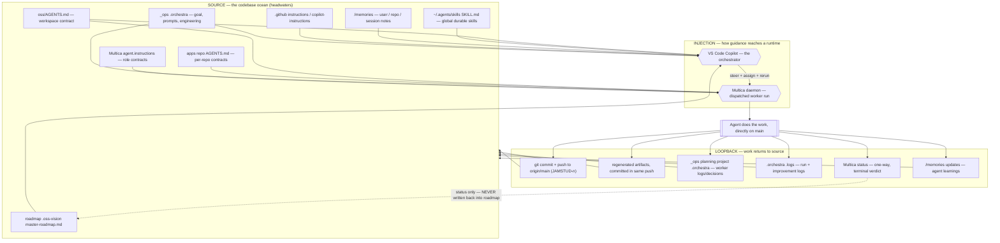

# Agent Context Architecture — the injection → work → loopback river

How agent guidance flows from the codebase **source** out to every runtime, and how the work flows
**back** to that source. This is the durable map of "what is injected where, to whom, when, and how,
and how it returns to the ocean." It is a reference, not a roadmap — status and assignments live in
Multica, not here.

> Sibling to [source-of-truth-policy.md](source-of-truth-policy.md): that doc owns *where truth lives*;
> this doc owns *how that truth is injected into agents and how their output returns to it.*

## The river (flow diagram)

## What is injected where, when, and how

| Source | Injected to whom | When | How |
| --- | --- | --- | --- |
| `oss/AGENTS.md` | Copilot orchestrator + every Multica worker | Session/run start | Auto-loaded as workspace contract; auto-read from the checked-out workdir |
| `apps/<repo>/AGENTS.md` | Worker touching that repo | On entering the repo | Auto-read repo contract |
| `~/.agents/skills/<skill>/SKILL.md` | Any agent | On demand (when the task matches) | Progressive disclosure — agent reads the SKILL.md file |
| `/memories/` (user/repo/session) | Copilot orchestrator | Session start (user: first 200 lines auto; repo/session: listed, read on demand) | Memory tool |
| `_ops/.orchestra` (goal, prompts, engineering) | Orchestrator (always); worker (via reference) | Orchestrator: every run. Worker: at dispatch | Orchestrator reads directly; worker gets the prompt + steering via the issue comment |
| `roadmap master-roadmap.md` | Orchestrator | When selecting work | Read directly; projections generated to `generated/` |
| `.github/instructions/*` | Copilot in VS Code | Matching `applyTo` globs | VS Code auto-applies |
| Multica `agent.instructions` slot | The specific worker agent | Every run of that agent | Daemon injects the role contract into the agent's system context |
| Per-issue steering comment | The dispatched worker | At dispatch | `multica issue comment add` before `rerun` |

## How work returns to source

| Loopback channel | Carries | Destination |
| --- | --- | --- |
| `git commit + push` to `origin/main` | The actual implementation (subject carries `JAMSTUD-<n>`) | The repo — the source itself |
| Regenerated artifacts | Derived/generated bytes, committed in the same push | The repo |
| Worker logs/decisions/research | What a worker did and why | `_ops/planning/<project>/.orchestra/` |
| Orchestrator run + improvement logs | Run checkpoints; structural-change proposals | `.orchestra/.logs/` |
| Multica status | Terminal verdict (`done` / `blocked`) | Multica only — **one-way**, never hand-written into the roadmap |
| Memory updates | Durable learnings that prevent repeated mistakes | `/memories/` |

The loop is closed when a change lands on `main`, its artifacts/docs/tests are in parity, its status
is a terminal Multica verdict, and any durable learning is in memory. Code is the source of truth;
everything else is guidance until verified against it.

## Murky / legacy / nondeterministic chuff obstructing the flow

These are the loose ends that make the river fork unpredictably. Each is an `/untard` or `/upstream`
candidate — listed so they are tracked, not chased one domino at a time.

1. **Two-daemon nondeterminism.** A run can land on the CLI default-profile daemon *or* the desktop
   profile daemon. They ship different agent-context skill sets, so the *same* worker behaves
   differently depending on placement. **Fix:** standardize on one executor daemon (recommend the
   headless CLI daemon — see below). The CLI *binary* drives the board regardless and needs no daemon
   of its own; board ops hit the cloud backend directly.
2. **The `multica-working-on-issues` skill** (shipped by the desktop daemon's agent-context) reads a
   rich issue thread as "coordinate / delegate" and drives squad-leader thrash and no-op delegation
   instead of direct implementation. The CLI daemon does not ship it → cleaner direct-implementer
   behavior. Another reason to standardize on the CLI daemon.
3. **Roadmap path split (reconciled 2026-07-04).** Durable canon prose was aligned to the live form
   `_ops/planning/roadmaps/.oss-vision/`, which scripts, generated headers, and root AGENTS.md already
   used. Only the file-parsing scripts and generated provenance headers name `master-roadmap.md` (the
   legitimate "a system needs the exact file" case); durable docs point to the parent directory. A
   broader planning-taxonomy reconciliation (project-first prose vs the live category-first layout, and
   the `_standards`/`_research` names) remains open and is tracked with the repo-structure work.
4. **Absolute / transient path references** in injected contracts. Any reference that hardcodes a
   machine path (e.g. `C:\Users\...\_ops\planning\standards`) breaks on a fresh clone, another host,
   or CI. Injected contracts must use repo-relative paths and durable parent dirs, never absolute or
   transient filenames.
5. **Memory drift.** User/repo memory is auto-injected, so superseded notes ("all done" overstatements,
   conflicting agent rosters) pollute every session. Prune memory when it goes stale at the source.
6. **Status loopback ambiguity.** Workers sometimes leave issues `in_review` vs `done`, and a standing
   autopilot can race a manually-dispatched pass and double-write one `main` surface. One dispatcher
   (the orchestrator) + terminal-verdict status keeps the loop single-writer.
7. **Prompt-delivery determinism.** Worker prompts live in `.orchestra/prompts/` but reach workers via
   reference/steering, not a guaranteed file in the (possibly shallow) checked-out clone. The contract
   must survive a missing reference file — the rules an agent needs to act are in AGENTS.md + steering.

## Executor daemon recommendation (determinism at the injection seam)

- The **CLI binary** (`multica …`) is essential and non-negotiable: it is the entire scriptable
  orchestration surface, and its board commands (`issue list/assign/rerun/status/comment`) talk to the
  shared cloud backend **without needing a local daemon**.
- Run exactly **one executor daemon**. Recommend the **headless CLI (default-profile) daemon**: no GUI
  dependency, one deterministic workspace root, and it does not ship the coordination skill that causes
  thrash. The desktop app/daemon's only edge is a GUI to eyeball the board + auto-start convenience.
- Never run both daemons at once — a model runtime registers to only one, so two live daemons collide
  and break dispatch. Open the desktop GUI only for human viewing, and stop one before the other runs.
- Verify on next start that the intended runtime (e.g. `copilot`) registers to the chosen daemon
  (`multica daemon status`) before dispatching.
